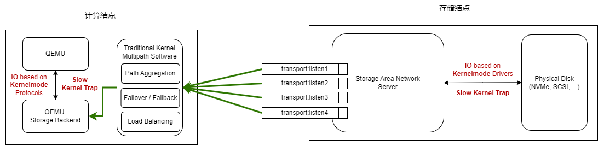
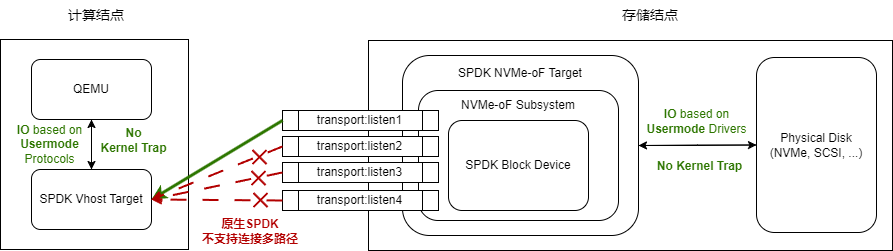
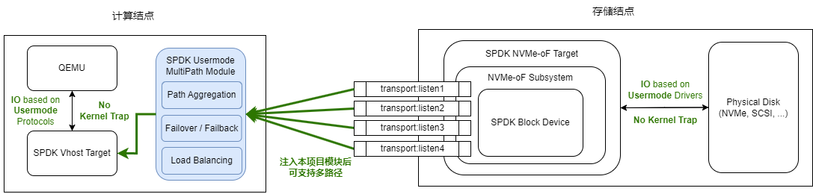
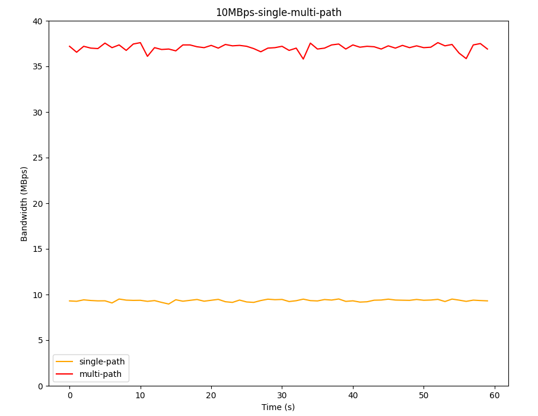
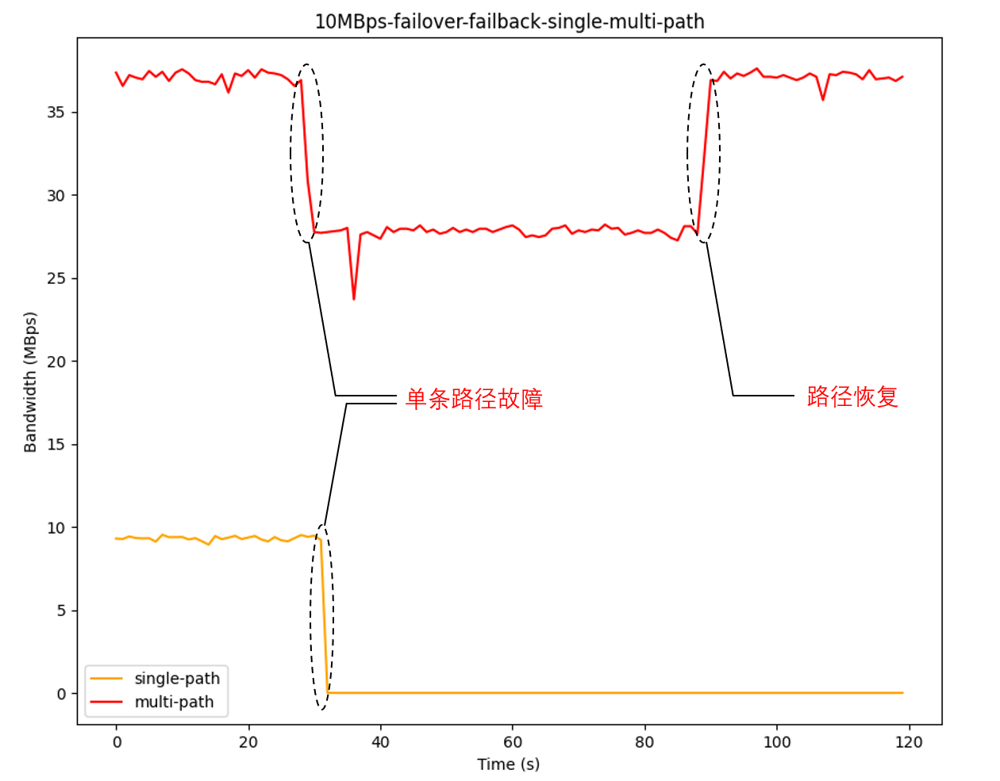
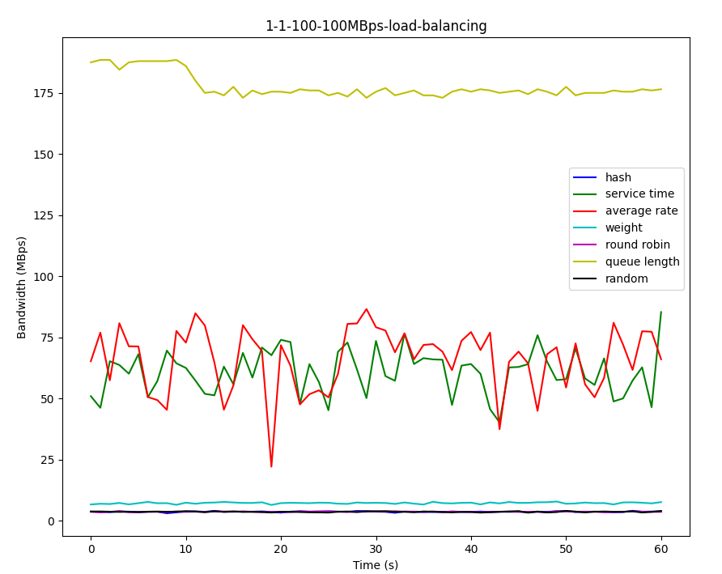
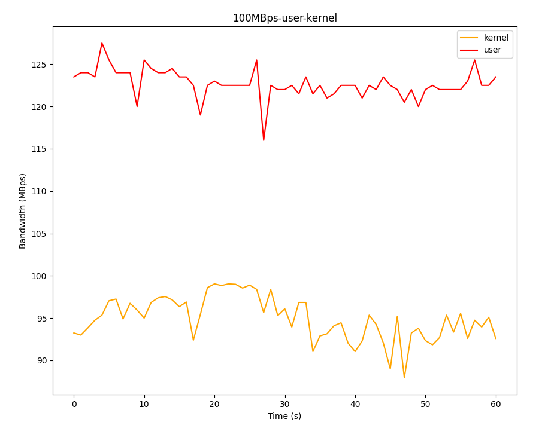

# SPDK 用户态 IO 多路径软件 SUMP (SPDK-USERSPACE-MULTI-PATH)

赛题：[proj113-spdk-based-io-multi-path](https://github.com/oscomp/proj113-spdk-based-io-multi-path)

本项目获得了2023年第三届全国大学生计算机系统能力大赛操作系统设计赛的**国家级一等奖**。

[一等奖+4！深圳校区学子在全国大学生操作系统设计赛中创历史最佳战绩](https://www.hitsz.edu.cn/article/view/id-142937.html)

比赛提交仓库访问链接：[https://gitlab.eduxiji.net/202318123111333/project1466467-176092](https://gitlab.eduxiji.net/202318123111333/project1466467-176092)

## [决赛文档在线链接](https://bugmaker-proj113.gitee.io)

## 参赛队简介

学校：哈尔滨工业大学（深圳）

队长：孙铎

队员：赖嘉欣、俞文博

校内导师：夏文、李诗逸

校外导师：曹金华（华为）

## 项目简介

&nbsp;&nbsp;&nbsp;&nbsp;&nbsp;&nbsp;&nbsp;在虚拟化云计算场景下，**计算结点**与**存储结点**分离，计算结点要通过**网络**将 **IO 请求**发送至存储结点，存储结点再通过**网络**将 **IO 响应**发送至计算结点。传统的基于**内核态驱动**的 IO 和**内核多路径软件**可以应用于此场景，但这样会导致较为频繁地内核陷入陷出，加长了虚拟机的 IO 路径，减慢了 IO 速度：



图1 传统内核多路径的方案

&nbsp;&nbsp;&nbsp;&nbsp;&nbsp;&nbsp;&nbsp;为了提升计算结点虚拟机的 IO 性能，虚拟机 IO 通常会经过**用户态组件 SPDK** 处理，也就是使用 **Vhost-user 协议**，绕过主机内核。一方面，这种方式**缩短了虚拟机 IO 路径**，减少了 **CPU 陷入陷出**；另一方面，IO 不经过 Linux 内核，也就无法使用 Linux 内核提供的 **IO 多路径**方案。

&nbsp;&nbsp;&nbsp;&nbsp;&nbsp;&nbsp;&nbsp;将上述场景具体一点来讲，在存储结点，可以使用 **SPDK NVMe-oF Target** 提供远程的 IO 功能，在计算结点，可以使用 **QEMU 以及 SPDK Vhost Target** 为虚拟机处理 IO，其中 SPDK Vhost Target 既作为半虚拟化 QEMU 进行磁盘 IO 的后端，又负责连接远程存储结点的 SPDK NVMe-oF Target，如图2所示：



图2 SPDK 原生无多路径的方案

&nbsp;&nbsp;&nbsp;&nbsp;&nbsp;&nbsp;&nbsp;在这样的场景下，用户态 SPDK 驱动**无法使用 Linux 内核的多路径方案**来管理多条 IO 路径，并且原生的 SPDK 应用规定计算结点与存储结点的同一块磁盘**只能连接一条路径**，这容易出现单条路径故障导致 IO 彻底断开等问题，不能保证**高可用性**，也容易出现单条路径带宽受限的情况等问题，不能保证**高效性**。基于此，本项目计划开发一个 **SPDK 用户态多路径软件**，模仿 Linux 内核的多路径方案，在这种虚拟化云计算场景下管理多条 IO 路径，从而既能利用 **SPDK 用户态驱动**提高 IO 效率，又能通过**多路径软件**管理提高 IO 路径**可用性**和**可靠性**。

&nbsp;&nbsp;&nbsp;&nbsp;&nbsp;&nbsp;&nbsp;我们的实现方案可以简要概括为：通过**劫持动态链接库**的方式，在**无侵入、不修改 SPDK 原本代码**的基础上，为 SPDK 扩展一个**用户态多路径组件**，这个模块依然运行在用户态下，**拦截 SPDK 原生组件创建的远程 IO 路径**，并将其统一管理，聚合成一条高效可靠的路径，再提供给 SPDK 原生模块，让其像使用原生 IO 路径一样的方式使用这条聚合多路径，并再在此基础上进一步开发，实现**故障处理、负载均衡**等多路径功能，如图3所示。



图3 注入本项目多路径模块的方案

&nbsp;&nbsp;&nbsp;&nbsp;&nbsp;&nbsp;&nbsp;我们在初赛阶段实现了路径聚合和部分故障处理的功能，可以将连接同一物理磁盘的多条冗余路径聚合成为一条路径。经过测试，我们发现 SUMP 能将 4 条冗余**路径聚合**成 1 条可靠的路径，在带宽受限（10MBps）的场景下，多路径的性能可以达到**单路径性能的 4 倍**，如下图所示：



图4 单路径与多路径速度对比

&nbsp;&nbsp;&nbsp;&nbsp;&nbsp;&nbsp;&nbsp;我们在**决赛阶段**重点实现了**故障处理**的功能，在单条链路出现故障时，多路径模块能进行**故障切换**，继续通过其他路径提供可靠的 IO，当故障链路径重连时，多路径模块还能进行**故障恢复**，而单路径并不具备这样的功能，在出现故障时只能**被迫中断 IO**：



图5 单路径与多路径故障处理对比

&nbsp;&nbsp;&nbsp;&nbsp;&nbsp;&nbsp;&nbsp;在**决赛阶段**，我们还重点实现了**负载均衡**的功能，包括**四种静态负载均衡算法**和**三种动态负载均衡算法**：

- 静态负载均衡算法
  - Round Robin：**轮询**各条路径
  - Random：**随机**选择一条路径
  - Hash：根据本次 IO 请求和**哈希**函数的计算结果选择一条路径
  - Weight：根据各条路径的**权重**选择一条路径
- 动态负载均衡算法
  - Service Time：选择**平均时延最小**的路径
  - Average Rate：选择**平均速度最大**的路径
  - Queue Length：选择**未处理 IO 数（IO 队列深度）最小**的路径

&nbsp;&nbsp;&nbsp;&nbsp;&nbsp;&nbsp;&nbsp;在带宽受限、4 条路径带宽不均衡（1MBps、1MBps、100MBps、100MBps）的场景下，各负载均衡算法的 IO 速度如下图所示，其中**动态**负载均衡的效果远好于**静态**负载均衡，且**队列深度动态负载均衡算法**的表现最佳：



图6 多路径静态与动态负载均衡算法对比

&nbsp;&nbsp;&nbsp;&nbsp;&nbsp;&nbsp;&nbsp;上述场景均以 NVMe-oF 存储网络协议为例，而我们的用户态多路径模块还可以对接 **iSCSI 存储网络协议**，这也是**传统内核多路径软件**的重要应用场景。在**决赛阶段**，我们使用同样的 **NVMe 磁盘**、同样的 **iSCSI 存储网络协议**、同样的队列深度**负载均衡算法**、同样带宽受限的 **4 条路径不均衡路径**和同样的 IO 规模，对比测试了用户态与内核态多路径的性能，我们的用户态多路径相较于内核态，可以有 30% 左右的性能提升：



图7 用户态与内核态多路径负载均衡速度对比

本项目的**特点、先进性和创新性**在于：

- 赛题来源于**存储区域网络**和**虚拟化应用**等场景，适用于云计算中**半虚拟化、计算结点与存储结点分离**的场景，这是真实应用在企业后端的架构
- 基于 SPDK **用户态高效 IO 驱动**，开发出**此前未有**的 SPDK 用户态通用多路径软件，实现**从零到一**的突破
- 通过贴合 SPDK 框架的设计和开发，减少多路径额外的性能开销，取得了相较于 **SPDK 原生单路径和传统 Linux 内核态多路径软件**的性能优势（如图4、图5以及图7所示）
- 聚合**用户态驱动下的多条冗余 IO 路径**，继承了 SPDK 用户态 IO 的先进性，又开创了必要的用户态多路径**故障处理**和**负载均衡**，实现了真正的**用户态 IO 高可用和高性能**
- 通过**劫持动态链接库**的方式，为 SPDK 动态地扩展一个模块，实现**零侵入式开发**，而不是侵入 SPDK 修改源码
- 具有**通用多路径软件**的**所有标准功能**，支持**冗余屏蔽**、**故障处理**、**静态负载均衡**和**动态负载均衡**
- 在 **SPDK 块设备抽象层**开发多路径模块，减少与具体协议和应用的**耦合**性，上层可对接 **QEMU** 半虚拟化、**NBD(Network Block Device)** 等应用，下层可对接 **iSCSI** 和 **NVMe-oF** 等存储网络协议

本项目的**难点**在于：

- 需要有**操作系统的虚拟化、存储网络和多路径等**相关背景知识，这是我们项目团队之前未曾接触过的，为此我们进行了较多的调研和学习，才更好地理解了 SPDK 对 **Vhost-user 协议**的实现，理解**半虚拟化** IO 和**用户态驱动** IO 的处理方式
- 需要在**SPDK 用户态操作系统存储驱动框架**的基础上开发，这不同于传统的**基于 Linux 内核态驱动的开发模式**，需要对 **SPDK 编程规范**有较多的了解，理清 SPDK 下发 IO、处理 IO、响应 IO、返回 IO 的一系列流程，还需要学习好其中涉及到的 `bdev`、`io_channel`、`io_device` 等数据结构，深入理解 SPDK 对于 IO 的封装，寻找到了其中可以优化利用的部分，才能编写出符合 SPDK 框架环境的代码
- SPDK 项目的代码量巨大（超过**300万行**），并且仍处于社区开发中，甚至存在一些**代码漏洞**，如**空指针**、**UAF** (Use After Free) 和泛型指针 `void*` 导致的**越界访问**等。我们的工作不仅仅是调用 SPDK 的接口来开发存储相关的软件，而是**为 SPDK 新增其原本没有的功能**，需要深刻理解 SPDK 代码中的具体细节，直面 SPDK 本身存在的漏洞，乃至经常使用 **gdb 工具**调试程序和内核转储文件，代码调试周期长，开发难度大

## 完成情况

依据原赛题描述，目标和我们的完成情况如下：

|目标|完成情况|主要工作
|-|-|-|
|【基本特征 - 初赛工作】支持屏蔽冗余路径。<br/>主机与存储通过多条链路相连，对于同一块磁盘，<br/>不同的链路均会呈现出一个磁盘设备，出现冗余，<br/>因此多路径软件需要支持冗余屏蔽功能，对用户呈现一个可用的磁盘设备。|基本完成|1. 劫持 `spdk_bdev_register` 函数，拦截上报的 `bdev` <br/>2. 基于 `TAILQ` 建立二级 `bdev` 队列，聚合 `uuid` 相同的 `bdev`<br>3. 基于 `TAILQ` 建立 `io_channel` 队列，组织起冗余 IO 路径<br>4. 向上级呈现统一的多路径 `bdev`，遵循其接口标准|
|【基本特征 - 初赛工作】支持路径选择。<br/>自动选择一条可用路径下发 IO。| 基本完成|1. 拦截上层下发的 `bdev_io`，提取多路径 `bdev` 的上下文<br/>2. 在检测到 IO 任务时遍历 `TAILQ` 块设备队列，将块设备对应的 IO 路径加入到 `TAILQ` 路径队列中<br/>3. 在 IO 任务请求提交时，从 `TAILQ` 路径队列中选择一条 `io_channel` 下发|
|【基本特征 - 初赛工作和**决赛工作**】支持故障切换和恢复。<br/>当多路径软件检测到路径故障时，自动将 IO 切换到可用路径；<br/>当多路径软件检测到路径恢复后，自动将路径添加到可用路径列表。|基本完成|1. 通过 SPDK 的接口检测 IO 任务是否成功，若失败则放弃这条 `io_channel`，并重新选择路径下发 IO<br/> 2. 定期对被放弃的 `io_channel` 进行用例测试，若能成功完成 IO 任务，则重新启用这条路径|
|【基本特征 - **决赛工作**】支持负载均衡。<br/>主机与存储之间通过多条 IO 路径相连，IO 可同时通过多条路径一起下发。|基本完成|1. 接收到一批 IO 请求时，循环遍历所有可用 `io_channel`，轮流选择下发 IO<br/>2. 以不同的切换速度遍历各 IO 路径，尝试寻找到最佳切换频率|
|【进阶特性 - **决赛工作**】负载均衡场景下，支持不同的负载均衡算法，如 round_robin 等。|基本完成|1. 实现了4种静态负载算法（Round Robin、Random、Hash、Weight）<br/>2. 实现了3种动态负载均衡算法（Service Time、Average Rate、Queue Length）|
|【进阶特性 - **决赛工作**】支持最优路径选择。<br/>自动选择一条最优路径下发 IO。|大致完成|每次选择负载均衡效果最佳的路径|

## 仓库结构介绍

```plain
├── assets ------------------------------ 仓库 README.md 相关图片
├── docs -------------------------------- 项目文档（使用 docsify 生成）
│   ├── assets                    
│   ├── index.html                    
│   └── README.md                   
├── iscsi ------------------------------- iscsi模块
├── Makefile ---------------------------- 多路径软件编译运行的 Makefile
├── nvme -------------------------------- nvme模块
├── nvmf -------------------------------- nvmf模块
├── README.md --------------------------- 项目及仓库介绍文件
├── scripts                   
│   ├── kill.sh ------------------------- 根据目录杀死进程
│   ├── port_limit.sh ------------------- 端口限速脚本
│   ├── stop.sh ------------------------- 结束运行脚本
│   ├── target.sh ----------------------- 存储端运行脚本
│   └── vhost.sh ------------------------ 主机端运行脚本
├── sump.c ------------------------------ 多路径软件主文件
├── sump_ctrl.c ------------------------- 多路径软件控制面代码
├── sump_data.c ------------------------- 多路径软件数据面代码
├── sump.h ------------------------------ 多路径软件主头文件
├── sump_spdk.h ------------------------- 与 SPDK 相关的结构体、宏定义等
├── sump_util.c ------------------------- 工具函数
└── 决赛文档（建议通过文档在线链接访问）.pdf
```
