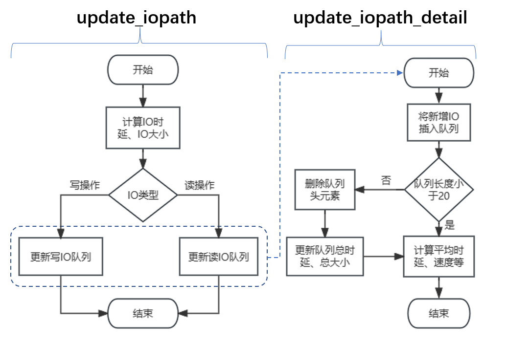

<!-- <style>
h1 {
    border-bottom: none
}
h2 {
    border-bottom: none
}
h3 {
    border-bottom: none
}
.md-toc { 
    margin-top:45px;
    padding-bottom:20px;
    font-size: 150%;  /* 目录文字大小 */
}
</style> -->

<!-- <font size=6> <center> **SPDK 用户态 IO 多路径软件决赛文档** </center> </font> -->

<!-- <font size=5> <center> **目录** </center> </font> -->

<!-- [TOC] -->

<!-- <div STYLE="page-break-after: always;"></div> -->

# SPDK 用户态 IO 多路径软件决赛文档

## 摘要

&nbsp;&nbsp;&nbsp;&nbsp;&nbsp;&nbsp;&nbsp;SUMP，全称为 SPDK-USERSPACE-MULTI-PATH ，是一款致力于在 SPDK 用户态驱动框架下实现**通用多路径功能**的软件。我们通过**劫持动态链接库**的方式，在**无侵入、不修改 SPDK 原本代码**的基础上，为 SPDK 扩展一个**用户态多路径组件**，这个模块依然运行在用户态下，**拦截 SPDK 原生组件创建的远程 IO 路径**，并将其统一管理，聚合成一条高效可靠的路径，再提供给 SPDK 原生模块，让其像使用原生 IO 路径一样的方式使用这条聚合多路径，并再在此基础上进一步开发，实现**故障处理、负载均衡**等多路径功能。

&nbsp;&nbsp;&nbsp;&nbsp;&nbsp;&nbsp;&nbsp;SUMP 是**竞赛驱动型项目**。根据赛题 [proj113](https://github.com/oscomp/proj113-spdk-based-io-multi-path) 的要求，本项目旨在完成以下目标：

- 【基本特征】支持屏蔽冗余路径。
- 【基本特征】支持路径选择。
- 【基本特征】支持故障切换和恢复。
- 【基本特征】支持负载均衡。
- 【进阶特征】支持最优路径选择。
- 【进阶特征】负载均衡场景下，支持不同的负载均衡算法，如 round_robin 等。

&nbsp;&nbsp;&nbsp;&nbsp;&nbsp;&nbsp;&nbsp;我们在初赛阶段实现了路径聚合和部分故障处理的功能，可以将连接同一物理磁盘的多条冗余路径聚合成为一条路径。经过测试，我们发现 SUMP 能将 4 条冗余**路径聚合**成 1 条可靠的路径，在带宽受限（10MBps）的场景下，多路径的性能可以达到**单路径性能的 4 倍**。

&nbsp;&nbsp;&nbsp;&nbsp;&nbsp;&nbsp;&nbsp;我们在**决赛阶段**重点实现了**故障处理**的功能，在单条链路出现故障时，多路径模块能进行**故障切换**，继续通过其他路径提供可靠的 IO，当故障链路径重连时，多路径模块还能进行**故障恢复**，而单路径并不具备这样的功能，在出现故障时只能**被迫中断 IO**。

&nbsp;&nbsp;&nbsp;&nbsp;&nbsp;&nbsp;&nbsp;在**决赛阶段**，我们还重点实现了**负载均衡**的功能，包括**四种静态负载均衡算法**和**三种动态负载均衡算法**。在带宽受限、4 条路径带宽不均衡（1MBps、1MBps、100MBps、100MBps）的场景下，我们对各负载均衡算法的 IO 性能进行了测试和探究，发现**动态**负载均衡的效果远好于**静态**负载均衡，且**队列深度动态负载均衡算法**的表现最佳。

&nbsp;&nbsp;&nbsp;&nbsp;&nbsp;&nbsp;&nbsp;上述场景均以 NVMe-oF 存储网络协议为例，而我们的用户态多路径模块还可以对接 **iSCSI 存储网络协议**，这也是**传统内核多路径软件**的重要应用场景。在**决赛阶段**，我们使用同样的 **NVMe 磁盘**、同样的 **iSCSI 存储网络协议**、同样的队列深度**负载均衡算法**、同样带宽受限的 **4 条路径不均衡路径**和同样的 IO 规模，对比测试了用户态与内核态多路径的性能，我们的用户态多路径相较于内核态，可以有 30% 左右的性能提升。

&nbsp;&nbsp;&nbsp;&nbsp;&nbsp;&nbsp;&nbsp;综上所述，我们的赛题完成情况如下：

|目标|完成情况|主要工作
|-|-|-|
|【基本特征 - 初赛工作】支持屏蔽冗余路径。<br/>主机与存储通过多条链路相连，对于同一块磁盘，<br/>不同的链路均会呈现出一个磁盘设备，出现冗余，<br/>因此多路径软件需要支持冗余屏蔽功能，对用户呈现一个可用的磁盘设备。|基本完成|1. 劫持 `spdk_bdev_register` 函数，拦截上报的 `bdev` <br/>2. 基于 `TAILQ` 建立二级 `bdev` 队列，聚合 `uuid` 相同的 `bdev`<br>3. 基于 `TAILQ` 建立 `io_channel` 队列，组织起冗余 IO 路径<br>4. 向上级呈现统一的多路径 `bdev`，遵循其接口标准|
|【基本特征 - 初赛工作】支持路径选择。<br/>自动选择一条可用路径下发 IO。| 基本完成|1. 拦截上层下发的 `bdev_io`，提取多路径 `bdev` 的上下文<br/>2. 在检测到 IO 任务时遍历 `TAILQ` 块设备队列，将块设备对应的 IO 路径加入到 `TAILQ` 路径队列中<br/>3. 在 IO 任务请求提交时，从 `TAILQ` 路径队列中选择一条 `io_channel` 下发|
|【基本特征 - 初赛工作和<font color="red">决赛工作</font>】支持故障切换和恢复。<br/>当多路径软件检测到路径故障时，自动将 IO 切换到可用路径；<br/>当多路径软件检测到路径恢复后，自动将路径添加到可用路径列表。|基本完成|1. 通过 SPDK 的接口检测 IO 任务是否成功，若失败则放弃这条 `io_channel`，并重新选择路径下发 IO<br/> 2. 定期对被放弃的 `io_channel` 进行用例测试，若能成功完成 IO 任务，则重新启用这条路径|
|【基本特征 - <font color="red">决赛工作</font>】支持负载均衡。<br/>主机与存储之间通过多条 IO 路径相连，IO 可同时通过多条路径一起下发。|基本完成|1. 接收到一批 IO 请求时，循环遍历所有可用 `io_channel`，轮流选择下发 IO<br/>2. 以不同的切换速度遍历各 IO 路径，尝试寻找到最佳切换频率|
|【进阶特性 - <font color="red">决赛工作</font>】负载均衡场景下，支持不同的负载均衡算法，如 round_robin 等。|基本完成|1. 实现了4种静态负载算法（Round Robin、Random、Hash、Weight）<br/>2. 实现了3种动态负载均衡算法（Service Time、Average Rate、Queue Length）|
|【进阶特性 - <font color="red">决赛工作</font>】支持最优路径选择。<br/>自动选择一条最优路径下发 IO。|大致完成|每次选择负载均衡效果最佳的路径|

<!-- <div STYLE="page-break-after: always;"></div> -->

## 1 概述

### 1.1 项目背景及意义

&nbsp;&nbsp;&nbsp;&nbsp;&nbsp;&nbsp;&nbsp;存储区域网络（Storage Area Network，SAN）是企业最常用的后端存储架构，适用于**高吞吐量**和**低延迟**的业务，已经成为现代科技领域中不可或缺的重要技术。SAN 是一种连接**服务器**和**存储设备**的专用网络，其基本结构如图1所示。该技术把系统拆分为**计算结点、存储结点**两大模块，并将两者分别部署，以实现**计算功能和存储功能的解耦合**，从而在充分满足用户**高存储量需求**的同时，兼顾**应用程序性能**的提升，为用户提供了灵活、高效、安全、便利、可扩展的计算环境与计算模式。

<div style="text-align: center">


</div>

<div style="text-align: center">图1 SAN 基本结构</div>

&nbsp;&nbsp;&nbsp;&nbsp;&nbsp;&nbsp;&nbsp;SAN 往往基于 FCP 、iSCSI 、FCoE 、FC-NVMe 等协议实现，可以帮助企业实现较多性能要求较高的业务关键型应用，如 Oracle 数据库、Microsoft SQL Server 数据库、大型虚拟桌面基础架构等。SAN 广泛应用于数据密集型的企业和组织，如金融机构、医疗保健机构、媒体和娱乐行业等。它在虚拟化环境下尤为重要，可为虚拟服务器提供高性能、可靠的存储支持。

&nbsp;&nbsp;&nbsp;&nbsp;&nbsp;&nbsp;&nbsp;然而，在上述过程中，**计算结点**与**存储结点**需要借助网络进行通信，完成 IO 请求与 IO 响应。如果两者之间只有一条链路，显然容易存在**单点故障问题**。因此，为了提高可靠性、安全性，人们通常会引入**多路径技术**，即在两结点之间构建多个不同的通信链路，通过路径的增设来避免单一部件故障所造成的系统整体无法正常运转的问题。然而，在增设了多条路径之后，又有许多**新的问题**接踵而至：

- **路径选择**问题。对于多条可用的路径，如何从中选择一条有用的来下发 IO 请求？是否能找到一种最优的路径选择策略？
- **冗余路径屏蔽**问题。增设路径后，不同的链路往往会指向同一个逻辑存储单元，造成冗余。因此，在选定了其中一条 IO 路径之后，如何屏蔽掉剩余的冗余路径，从而最终只向用户呈现出一条经过聚合后的路径？
- **故障切换和恢复**问题。当选定的某条 IO 路径发生故障时，如何自动透明地切换至其它正常路径？当前测到故障路径恢复至正常状态后，如何将其自动添加回可用路径列表？
- **负载均衡**问题。如何实现多条可用的路径之间的负载均衡，从而避免出现某些路径的 IO 流量过高、某些路径的 IO 流量过低的情况？

&nbsp;&nbsp;&nbsp;&nbsp;&nbsp;&nbsp;&nbsp;为了解决上述一系列多路径场景下的问题，多路径软件应运而生。当前，**Linux 内核态下的多路径软件已经相当丰富**，一大批技术成熟、功能完备的**内核态多路径软件与模块**，为多路径场景下可能出现的各类问题提供了有效解决方案。其中一种广泛使用的内核态多路径软件是 Multipath-TCP [<sup>2</sup>](#refer-anchor-2) 。 Multipath-TCP 能够同时利用多个网络路径传输数据，允许应用程序在传输数据时同时使用多个网络连接，将网络带宽最大化，并提供了容错和故障恢复的功能。它在数据中心和企业网络中广泛应用，以提高网络性能和可靠性。

&nbsp;&nbsp;&nbsp;&nbsp;&nbsp;&nbsp;&nbsp;另一种常用的内核态多路径软件是 DM-Multipath [<sup>3</sup>](#refer-anchor-3) 。DM-Multipath 是 Linux 内核的一个模块，能够在多个路径之间进行负载均衡，并在路径故障发生时自动切换到可用的路径。它通过监测路径的状态和性能，动态地选择最佳的路径来传输数据。这种智能的路径选择机制可以最大限度地提高系统的可用性和性能。

<div style="text-align: center">


</div>

<div style="text-align: center">图2 传统内核多路径</div>

&nbsp;&nbsp;&nbsp;&nbsp;&nbsp;&nbsp;&nbsp;如图2所示，上述传统多路径软件都是在**内核态**存储驱动的基础上实现的。但在云计算**虚拟化**场景下，SAN 往往通过虚拟化技术来实现资源的抽象和隔离，从而将物理资源划分为多个虚拟资源提供给用户。这就会导致**传统内核态多路径软件**面临 **IO 路径过长、陷入陷出状态切换开销大**的新问题。虚拟机在进行 IO 操作的时候，需要先从**虚拟机的用户态**切换为**虚拟机的内核态**，然后到达**主机的用户态**，接着再从**主机的用户态**切换到**主机的内核态**。这就使得**虚拟机的 IO 路径过长**，需要经历两次**用户态、内核态切换**。在非虚拟化场景下，主机原本只需经历一次**用户态、内核态切换**，即可将 IO 请求交付给驱动层，进而推送至存储节点。对比虚拟化、非虚拟化两种场景，不难发现，虚拟化场景下**传统内核态多路径软件的开销会明显变大**。

&nbsp;&nbsp;&nbsp;&nbsp;&nbsp;&nbsp;&nbsp;2017 年，Intel 公司开发了**用户态存储驱动**套件（Storage Performance Development Kit，SPDK） [<sup>8</sup>](#refer-anchor-8) ，通过在**用户态**下的**无锁**和**轮询**机制，实现高性能 IO 。SPDK 能够让虚拟机的 IO 请求不再经由主机发出，而是通过用户态软件 SPDK Vhost Target 来处理虚拟机的 IO ，直接从虚拟机出发将 IO 交付给驱动层。

&nbsp;&nbsp;&nbsp;&nbsp;&nbsp;&nbsp;&nbsp;如图3所示，在存储结点，可以使用 SPDK NVMe-oF Target 提供远程的 IO 功能，在计算结点，可以使用 QEMU 以及 SPDK Vhost Target 为虚拟机处理 IO，其中 SPDK Vhost Target 既作为半虚拟化 QEMU 进行磁盘 IO 的后端，又负责连接远程存储结点的 SPDK NVMe-oF Target，从而**绕开主机内核**，大为缩短 IO 路径。

<div style="text-align: center">


</div>

<div style="text-align: center">图3 无多路径功能的 SPDK 原生 Vhost Target</div>

&nbsp;&nbsp;&nbsp;&nbsp;&nbsp;&nbsp;&nbsp;然而，**现阶段工业界还非常缺乏用户态下的 IO 多路径软件**。这就意味着，相比于内核态驱动，用户态驱动的 SPDK 虽然可以使用 vhost-user 协议缩短虚拟机的 IO 路径、提高闪存读写效率，但其不再经过主机内核，没有**内核通用多路径功能**的支持。这会导致系统容易出现 IO 路径选择不当、IO 分配不均和单条路径故障导致 IO 彻底断开等问题。

<div style="text-align: center">


</div>

<div style="text-align: center">图4 引入 SUMP 后的 SPDK 多路径</div>

&nbsp;&nbsp;&nbsp;&nbsp;&nbsp;&nbsp;&nbsp;基于以上背景，本项目开发了一套 **SPDK 用户态 IO 多路径软件 SUMP** (SPDK-USERSPACE-MULTI-PATH) ，在**虚拟化场景**下为 SAN 提供高效、可靠、稳定的使用体验。如图4所示，SUMP 借鉴了 Linux 内核的多路径方案，在虚拟化云计算场景下管理多条 IO 路径，从而既能利用 SPDK **用户态**驱动提高 IO 效率，又能通过多路径软件管理提高 IO 路径的可用性和可靠性。

### 1.2 研究现状调研

#### 1.2.1 Linux 内核多路径软件技术

&nbsp;&nbsp;&nbsp;&nbsp;&nbsp;&nbsp;&nbsp;Linux 内核多路径软件技术，也称为多路径 IO 技术（Multipath IO），是一种用于增强数据存储系统可靠性和性能的技术。它允许多个物理路径同时连接到存储设备，通过多个路径传输数据，从而提供冗余和负载均衡的功能。这意味着即使一个路径出现故障，系统仍然能够通过其他可用路径继续进行数据传输，而无需中断服务。

&nbsp;&nbsp;&nbsp;&nbsp;&nbsp;&nbsp;&nbsp;在 Linux 内核中实现多路径 IO 的关键组件是**设备映射器（device mapper）**子系统。设备映射器是 Linux 内核中的一个**核心模块**，它允许用户空间应用程序对块设备进行透明的重映射和转换。多路径 IO 技术使用设备映射器来创建一个虚拟设备，该设备将多个物理路径与单个逻辑设备关联起来。

&nbsp;&nbsp;&nbsp;&nbsp;&nbsp;&nbsp;&nbsp;多路径 IO 的**工作流程**如下：首先，当系统启动时，设备映射器子系统会扫描可用的存储设备，并为每个设备创建一个路径。然后，这些路径会根据其可用性和性能被分组为路径组。每个路径组都有一个主路径和一个或多个备用路径。主路径是首选路径，而备用路径则在主路径故障时用于备份。当应用程序发送 IO 请求时，Linux内核会将请求传递给设备映射器子系统。设备映射器子系统根据路径组的负载均衡策略选择一个路径来处理请求。如果所选路径是主路径且正常运行，请求将直接发送到存储设备。如果所选路径发生故障，设备映射器子系统将自动选择另一个可用路径来处理请求。

&nbsp;&nbsp;&nbsp;&nbsp;&nbsp;&nbsp;&nbsp;在多路径 IO 中，**故障检测和恢复**是非常重要的。为了实现故障检测和切换，设备映射器子系统会定期检查路径的可用性，并在检测到故障时自动切换到备用路径。它还支持用户手动操作，允许管理员通过命令行工具或配置文件手动添加、删除或修改路径。这种自动切换可以通过多种方式实现，如基于路径状态的切换、基于故障事件的切换等。

&nbsp;&nbsp;&nbsp;&nbsp;&nbsp;&nbsp;&nbsp;Kiyoshi Ueda 等人 [<sup>1</sup>](#refer-anchor-1) 介绍了一种针对存储设备的多路径输入/输出（Multipath IO）的解决方案。该解决方案通过将 Linux 内核当前的多路径层（dm-multipath）移到 IO 调度器下方、硬件特定子系统上方的位置，以试图兼具高层和低层两种实现方式的优势。文章还描述了该解决方案对块、Device-mapper 和 SCSI 层的改变以及其对性能的影响。

&nbsp;&nbsp;&nbsp;&nbsp;&nbsp;&nbsp;&nbsp;Edward Goggin 等人 [<sup>3</sup>](#refer-anchor-3) 提供了关于 Linux 多路径功能的概述，介绍了当前基于设备映射器的多路径技术的能力，并描述了未来对于提升多路径技术的企业级需求。在考虑使用案例时，文章描述了内核多路径模块、hotplug 、udev 和 kpartx 组件等部分之间的交互。使用案例包括路径与逻辑单元重新配置、分区管理以及用于 active-active 和 active-passive 通用存储系统的路径故障转移。文章还描述了在高端存储上测试 MD 方案时所获得的经验教训。

&nbsp;&nbsp;&nbsp;&nbsp;&nbsp;&nbsp;&nbsp;Tesfamariam Michae 等人 [<sup>4</sup>](#refer-anchor-4) 介绍了在数据中心环境中，为了最小化停机时间和服务中断，IT 部门需要避免高可用系统中的单点故障。针对存储区域网络（SAN），管理员可以设置多个冗余数据路径（多路径）来连接服务器和存储系统，以防止硬件故障导致数据流中断。文章概述了 Linux 操作系统下的两个多路径IO应用程序：设备映射多路径和 EMC PowerPath 软件，并对每个应用程序的优缺点进行了重点介绍。文章的主要内容包括多路径 IO 的基本原理、不同存储系统处理路径的方式、使用设备映射进行多路径 IO 的配置以及使用设备映射进行多路径 IO 的设置过程。

&nbsp;&nbsp;&nbsp;&nbsp;&nbsp;&nbsp;&nbsp;谭毓安等人 [<sup>5</sup>](#refer-anchor-5) 研究了 Linux 系统中多路径磁盘过滤驱动程序的设计和实现。驱动程序将物理磁盘的多路径封装为一个虚拟设备。虚拟设备的 IO 请求转发到磁盘设备上执行，由路径选择算法将主机的负载均衡地分配到各路径上。当路径发生故障时，由驱动程序将失败的 IO 请求切换到其它路径，屏蔽了路径故障。驱动程序利用多路径改善了主机的 IO 性能，提高了系统的可用性。谭毓安等人 [<sup>6</sup>](#refer-anchor-6) 为了利用存储区域网络的冗余路径，在主机上加入驱动程序对逻辑单元（LUN）的输入/输出请求进行截获。在故障路径上的 IO 请求失败后，由驱动程序在正常路径上重新执行。路径失败时 IO 请求直接发送给 HBA 驱动程序，避免了磁盘驱动程序中的无效重试过程，缩短了故障切换时间。IO 请求被分配到多条路径上，提高了主机的吞吐能力，缩短了 IO 平均响应时间。

&nbsp;&nbsp;&nbsp;&nbsp;&nbsp;&nbsp;&nbsp;Michael Anderson 等人 [<sup>7</sup>](#refer-anchor-7) 在 Linux 2.5+ 的 SCSI 中间层提供了一种多路径支持的方法。通过在该层次上实现多路径支持，可以同时在较低层次实现资源使用减少、性能改善，并在较高层次实现设备独立能力。

&nbsp;&nbsp;&nbsp;&nbsp;&nbsp;&nbsp;&nbsp;总之，Linux 内核 IO 多路径软件技术是一种通过创建虚拟设备并利用设备映射器子系统来实现数据存储系统的冗余和负载均衡的技术。它使用多个物理路径连接到存储设备，并根据负载均衡策略选择路径来处理 IO 请求。当一个路径发生故障时，多路径 IO 能够自动切换到备用路径，保证数据传输的连续性，减少系统中断和数据丢失的风险。此外，多路径 IO 还可以通过在多个路径上分布 IO 负载来提高性能，从而提升存储系统的整体吞吐量。多路径 IO 技术提高了系统的可用性、容错能力和性能，是数据存储系统中重要的软件技术之一。

#### 1.2.2 SPDK 技术

&nbsp;&nbsp;&nbsp;&nbsp;&nbsp;&nbsp;&nbsp;SPDK（Storage Performance Development Kit） [<sup>8</sup>](#refer-anchor-8) 是一个由英特尔开源的技术项目，旨在提供高性能的存储系统开发工具。SPDK 的设计目标是最大限度地减少存储系统软件栈的开销，减少 IO 路径中不必要的开销和复制操作，以实现更低的延迟和更高的吞吐量，充分利用现代存储设备的性能潜力。

&nbsp;&nbsp;&nbsp;&nbsp;&nbsp;&nbsp;&nbsp;SPDK 的核心思想是将应用程序直接连接到存储设备，绕过操作系统内核和传统的 IO 堆栈，以最大限度地减少数据传输的开销。这种直接访问的方式可以避免传统 IO 路径中的上下文切换、复制和锁等开销，从而提高存储性能和降低延迟。

1. SPDK 主要组成部件

- **用户态驱动**程序：SPDK 提供了一组用户态驱动程序，允许应用程序直接与存储设备进行交互，绕过传统的内核态驱动程序。这种方式避免了用户态和内核态之间的上下文切换，从而提高了 IO 处理的效率。

- **网络通信**库：SPDK 包含了高性能的网络通信库，用于在存储系统中进行高效的数据传输。这些库实现了零拷贝技术，通过将数据从存储设备直接发送到网络，避免了数据的多次复制，提高了传输效率。

- 高级功能库：SPDK 提供了一些高级功能库，用于简化存储应用程序的开发。例如，SPDK 提供了一个块设备模拟器，用于模拟块设备的行为，以便进行应用程序的测试和调试。此外，SPDK 还提供了用于异步事件处理、多线程管理和内存管理的库。

- **存储协议**支持：SPDK 支持多种存储协议，包括 NVMe（Non-Volatile Memory Express）和 iSCSI（Internet Small Computer System Interface）。这些协议是现代存储系统中常用的协议，SPDK 提供了相应的驱动程序和库，使开发者能够更方便地开发基于这些协议的存储应用程序。

<div id="refer-anchor-spdk-application-bdev"></div>

2. SPDK 应用的介绍

- 存储协议应用

  SPDK 有专门为**存储协议**设计的应用，其中 nvmf_tgt 可以实现 NVMe over Fabrics 的 target 功能，iscsi_tgt 可以实现 iSCSI 的 target 功能，二者均可以将本地的存储设备（如 NVMe SSD）通过网络协议（如 RDMA 或 TCP ）提供给远程的主机（host）使用，并支持多种存储后端。其中，iscsi_tgt 可以将 SPDK 的 bdev 层提供的任何块设备作为 iSCSI 的 LUN 导出，nvmf_tgt 可以将 SPDK 的 bdev 层提供的任何块设备作为 NVMe-oF 的 namespace 导出，如本地的 NVMe SSD、逻辑卷、加密设备等包括本地的 NVMe SSD、逻辑卷、加密设备等。

- Vhost 应用

  SPDK 中的 vhost 应用是一个基于用户态的存储服务，它可以将本地的存储设备（如 NVMe SSD）通过 vhost-user 协议提供给的虚拟机或其他进程使用，支持多种存储后端，可以将 SPDK 的 bdev 层提供的任何块设备作为 vhost 的 namespace 或 LUN 导出，同时利用SPDK的轮询模式和零拷贝技术，避免内核态和中断的开销，提高存储性能和效率。

3. bdev 层介绍

<div style="text-align: center">


</div>

<div style="text-align: center">图5 SPDK 存储架构</div>

- bdev 的概念

  如图5 [<sup>16</sup>](#refer-anchor-16) 所示，SPDK 中的块设备（bdev）是一种用户态的**存储抽象**层，它可以让用户通过统一的接口访问不同类型的**存储设备**，如 NVMe SSD、RAM Disk、Ceph RBD 、Linux AIO 等，使用户无需关心底层的存储协议和细节，提高存储性能和效率。同时，块设备还支持可插拔的模块化设计，用户可以根据需要加载不同的 bdev 模块，或者自定义自己的 bdev 模块，增加了灵活性和扩展性。

- 路径注册

  bdev 层管理着各类型存储设备，不同类型的存储设备在注册时，均需访问到 bdev 层进行注册，例如在进行设备多路径连接时，bdev 层会根据存储设备的来源（如 IP 地址和端口）将设备的路径抽象为一个块设备，并据此实现各种设备配置及 IO 操作。

4. 相关工作

&nbsp;&nbsp;&nbsp;&nbsp;&nbsp;&nbsp;&nbsp;Ziye Yang 等人 [<sup>8</sup>](#refer-anchor-8) 首次提出了 SPDK ，通过将必要的驱动程序移动到用户空间并在轮询模式而非中断模式下运行，实现了高性能，消除了内核上下文切换和中断处理的开销，并提供了无锁资源访问。与 SPDK 集成后，可以在这些快速存储设备上构建性能竞争力的存储应用程序。在实验中，SPDK 中的每个 CPU 核心的 NVMe 设备驱动程序的 IOPS 比内核 NVMe 驱动程序提高了约 6 倍至 10 倍。

&nbsp;&nbsp;&nbsp;&nbsp;&nbsp;&nbsp;&nbsp;Ziye Yang 等人 [<sup>9</sup>](#refer-anchor-9) 提出了一种名为 SPDK-vhost-NVMe 的 IO 服务目标，该目标依赖于用户空间 NVMe 驱动程序，并与虚拟化监控程序合作，加速虚拟机内的 NVMe IO 操作。通过该方法，可以消除不必要的虚拟机退出（VM_Exit）开销，并缩减主机操作系统中的 IO 执行堆栈，从而改善客户操作系统中存储 IO 的性能。

&nbsp;&nbsp;&nbsp;&nbsp;&nbsp;&nbsp;&nbsp;Junli He 等人 [<sup>10</sup>](#refer-anchor-10) 针对 OpenStack 云平台中虚拟机存在的长存储 IO 路径、低 IOPS（每秒输入/输出次数）和高延迟等问题，提出了一种基于 SPDK 的存储性能加速方案。该方案通过挂载 SPDK 类型的云硬盘，将虚拟化层的后端驱动程序卸载到用户态，使用轮询机制替代中断机制，并使用无锁队列来缩短 IO 路径、降低上下文切换频率和减少内存拷贝。实验结果显示，与挂载常规云硬盘的虚拟机相比，使用这种加速方案的虚拟机的读取 IOPS 和写入 IOPS 分别增加了 32.75% 和 549.02% ，读取带宽和写入带宽分别增加了 40.73% 和 35.18% ，读取延迟和写入延迟分别减少了 32% 和 18.81% 。

&nbsp;&nbsp;&nbsp;&nbsp;&nbsp;&nbsp;&nbsp;Yeohyeon Park 等人 [<sup>11</sup>](#refer-anchor-11) 利用 SPDK 设计了一个网络键值存储（network key-value store），该存储具有键值接口，完全避免了操作系统文件系统的软件层开销，并允许客户端通过计算机网络访问<key, value>元组，就像访问本地键值存储一样。研究还揭示了该存储的实现可行性。

&nbsp;&nbsp;&nbsp;&nbsp;&nbsp;&nbsp;&nbsp;总之，通过使用 SPDK ，开发者可以实现高性能的存储应用程序。SPDK 的设计理念是尽量减少不必要的中间层和复杂性，以降低开销并提高性能。它提供了一套丰富的工具和库，使开发者能够更好地利用现代存储设备的潜力，从而构建出高效可靠的存储解决方案。

#### 1.2.3 存储网络协议

&nbsp;&nbsp;&nbsp;&nbsp;&nbsp;&nbsp;&nbsp;存储网络协议是用于在计算机系统之间传输数据并管理存储资源的一组规则和标准。它们允许计算机系统通过网络连接访问和管理远程存储设备（如硬盘、固态驱动器等），从而实现数据存储、读写、备份、共享。在存储网络协议中，有多种重要的协议类型，其中两种最主要的协议是分别 iSCSI 协议和 NVMe-oF 协议。

1. iSCSI 协议

&nbsp;&nbsp;&nbsp;&nbsp;&nbsp;&nbsp;&nbsp;iSCSI（Internet Small Computer System Interface）是一种用于在IP网络上传输SCSI命令的存储网络协议。它允许计算机通过标准的IP网络连接到远程存储设备，将存储设备虚拟化为本地磁盘，从而实现存储资源的共享和访问。

- Initiator（发起者）：Initiator 是客户端计算机，负责发起 iSCSI 连接和发送 SCSI 命令。通过 iSCSI Initiator 软件，计算机可以识别远程存储设备并将其挂载为本地磁盘。

- Target（目标设备）：Target 是存储设备或存储服务器，它响应 Initiator 发送的 iSCSI 连接请求，并提供存储资源。Initiator可以访问 Target 上的存储资源，如磁盘分区或卷。

- Portal（入口）：Portal 是用于建立 iSCSI 连接的网络地址。一个 Portal 可以包含 IP 地址和端口号。Initiator 通过连接到 Target 的 Portal 来建立通信通道，然后进行 SCSI 命令的传输。

2. NVMe-oF 协议

&nbsp;&nbsp;&nbsp;&nbsp;&nbsp;&nbsp;&nbsp;NVMe-oF（Non-Volatile Memory Express over Fabrics）是一种用于在存储网络上传输 NVMe 命令的协议，它的设计旨在提高闪存存储设备的性能和可伸缩性。NVMe-oF 允许多个主机通过网络连接到 NVMe 存储设备，实现高速、低延迟的存储访问。

- Subsystem（子系统）：NVMe-oF Subsystem 是提供 NVMe 存储资源的实体，它可以是一个独立的存储设备，如一块 NVMe SSD，也可以是一个存储阵列。Subsystem 包含一组 NVMe 命名空间（Namespace），每个命名空间都代表一个逻辑的存储区域。通过 NVMe-oF，主机可以访问这些命名空间，执行读取和写入操作。

&nbsp;&nbsp;&nbsp;&nbsp;&nbsp;&nbsp;&nbsp;总之，存储网络协议如 iSCSI 协议和 NVMe-oF 协议在计算机系统之间提供了高效的存储资源共享和访问方式，从而支持数据中心和企业环境中的存储需求。它们允许计算机系统通过网络连接访问和管理远程存储设备，提高了存储资源的利用率和灵活性。

#### 1.2.4 虚拟化协议

&nbsp;&nbsp;&nbsp;&nbsp;&nbsp;&nbsp;&nbsp;虚拟化协议是一种用于在虚拟化环境中实现虚拟机与物理主机通信和数据交换的通信规范或协议。在计算机虚拟化中，一个物理主机可以运行多个虚拟机实例，每个虚拟机都可以视为一个独立的计算实体。虚拟化协议提供了传递数据、指令和状态信息的机制，定义了虚拟机和物理主机之间的通信接口、数据格式，可以使虚拟机模拟连接到硬件设备（如网络适配器、存储控制器等），并帮助虚拟机与物理主机进行资源共享，最大限度地减少资源浪费，同时实现高性能的数据传输。

&nbsp;&nbsp;&nbsp;&nbsp;&nbsp;&nbsp;&nbsp;虚拟化协议通常涉及到以下几个方面的功能：

- 设备虚拟化（Device Virtualization）：虚拟化协议可以实现将物理设备（例如网络适配器、磁盘控制器等）虚拟化为多个虚拟设备，使每个虚拟机都能够使用这些虚拟设备，而不需要物理设备的直接访问。

- 性能优化（Performance Optimization）：虚拟化协议可以优化数据传输和通信过程，减少虚拟机与主机之间的开销，提高性能。

- 资源共享（Resource Sharing）：虚拟化协议可以实现虚拟机之间的资源共享，例如在虚拟网络中进行通信，共享存储等。

- 隔离性与安全性（Isolation and Security）：虚拟化协议可以确保虚拟机之间的隔离性，防止不同虚拟机之间的干扰，同时提供安全性保障。

&nbsp;&nbsp;&nbsp;&nbsp;&nbsp;&nbsp;&nbsp;在虚拟化环境中，有许多不同的虚拟化协议，每个协议都专门用于处理特定类型的设备或通信。两个较为常见的虚拟化协议是 virtio-SCSI 协议和 vhost-user 协议。

&nbsp;&nbsp;&nbsp;&nbsp;&nbsp;&nbsp;&nbsp;virtio-SCSI 协议。这是一种用于虚拟化存储设备的协议。它结合了 virtio（一种通用的虚拟化设备驱动框架）和 SCSI（Small Computer System Interface，一种用于连接计算机与外部设备的标准接口）。virtio-SCSI 将 SCCI 虚拟化，使虚拟机可以通过虚拟设备与物理主机通信并使用 SCSI 协议来访问主机上的存储设备，例如硬盘、SSD 等。virtio-SCSI 在主机和虚拟机之间引入了一种轻量级、高性能的通信机制，从而实现了高效的存储访问，无需直接与物理硬件交互。

&nbsp;&nbsp;&nbsp;&nbsp;&nbsp;&nbsp;&nbsp;vhost-user 协议。这是一种用于实现虚拟机与主机之间高性能网络通信的协议。在传统虚拟化环境中，虚拟机的网络数据包处理通常需要经过物理主机的网络堆栈，这可能引入一些性能开销。然而，vhost-user 协议通过将虚拟机的网络处理功能迁移到用户态进程中，避免了不必要的内核态切换，从而降低了数据传输延迟，提升了网络性能。此外，vhost-user 协议使虚拟机能够将网络数据包传递给主机上运行的网络协议栈，从而减轻了虚拟机内部的网络处理负担，进一步提高了网络吞吐量。

&nbsp;&nbsp;&nbsp;&nbsp;&nbsp;&nbsp;&nbsp;总之，虚拟化协议定义了主机和虚拟机之间的通信方式和数据传输格式，以便虚拟机能够有效地使用主机的硬件资源，在虚拟化环境中起着至关重要的作用。这有助于提高性能、降低延迟，并简化虚拟化环境的管理和维护。

### 1.3 项目的主要工作

&nbsp;&nbsp;&nbsp;&nbsp;&nbsp;&nbsp;&nbsp;SUMP 是竞赛驱动型项目，我们的所有主要工作都完全围绕赛题要求进行，具体如表1所示。

|目标|完成情况|主要工作
|-|-|-|
|【基本特征 - 初赛工作】支持屏蔽冗余路径。<br/>主机与存储通过多条链路相连，对于同一块磁盘，<br/>不同的链路均会呈现出一个磁盘设备，出现冗余，<br/>因此多路径软件需要支持冗余屏蔽功能，对用户呈现一个可用的磁盘设备。|基本完成|1. 劫持 `spdk_bdev_register` 函数，拦截上报的 `bdev` <br/>2. 基于 `TAILQ` 建立二级 `bdev` 队列，聚合 `uuid` 相同的 `bdev`<br>3. 基于 `TAILQ` 建立 `io_channel` 队列，组织起冗余 IO 路径<br>4. 向上级呈现统一的多路径 `bdev`，遵循其接口标准|
|【基本特征 - 初赛工作】支持路径选择。<br/>自动选择一条可用路径下发 IO。| 基本完成|1. 拦截上层下发的 `bdev_io`，提取多路径 `bdev` 的上下文<br/>2. 在检测到 IO 任务时遍历 `TAILQ` 块设备队列，将块设备对应的 IO 路径加入到 `TAILQ` 路径队列中<br/>3. 在 IO 任务请求提交时，从 `TAILQ` 路径队列中选择一条 `io_channel` 下发|
|【基本特征 - 初赛工作和<font color="red">决赛工作</font>】支持故障切换和恢复。<br/>当多路径软件检测到路径故障时，自动将 IO 切换到可用路径；<br/>当多路径软件检测到路径恢复后，自动将路径添加到可用路径列表。|基本完成|1. 通过 SPDK 的接口检测 IO 任务是否成功，若失败则放弃这条 `io_channel`，并重新选择路径下发 IO<br/> 2. 定期对被放弃的 `io_channel` 进行用例测试，若能成功完成 IO 任务，则重新启用这条路径|
|【基本特征 - <font color="red">决赛工作</font>】支持负载均衡。<br/>主机与存储之间通过多条 IO 路径相连，IO 可同时通过多条路径一起下发。|基本完成|1. 接收到一批 IO 请求时，循环遍历所有可用 `io_channel`，轮流选择下发 IO<br/>2. 以不同的切换速度遍历各 IO 路径，尝试寻找到最佳切换频率|
|【进阶特性 - <font color="red">决赛工作</font>】负载均衡场景下，支持不同的负载均衡算法，如 round_robin 等。|基本完成|1. 实现了4种静态负载算法（Round Robin、Random、Hash、Weight）<br/>2. 实现了3种动态负载均衡算法（Service Time、Average Rate、Queue Length）|
|【进阶特性 - <font color="red">决赛工作</font>】支持最优路径选择。<br/>自动选择一条最优路径下发 IO。|大致完成|每次选择负载均衡效果最佳的路径|

<div style="text-align: center">表1 项目的主要工作</div>

## 2 系统设计

### 2.1 设计目标

&nbsp;&nbsp;&nbsp;&nbsp;&nbsp;&nbsp;&nbsp;本项目基于 SPDK 框架，在**虚拟化场景**下构建**用户态** IO 多路径软件，为 SPDK 架构下的系统提供**更可靠、更安全**的数据传输服务。本项目通过劫持动态链接库的方式，在**无侵入、不修改 SPDK 原本代码**的基础上，为 SPDK 扩展一个用户态多路径组件，这个模块依然运行在用户态下，拦截 SPDK 原生组件创建的远程 IO 路径，并将其统一管理，聚合成一条高效可靠的路径，再提供给 SPDK 原生模块，让其像使用原生 IO 路径一样的方式使用这条聚合多路径。

&nbsp;&nbsp;&nbsp;&nbsp;&nbsp;&nbsp;&nbsp;具体而言，本项目致力于达成以下目标：

- 功能实现完备
    - 屏蔽冗余路径：即实现**路径聚合**的功能。当完成路径选择后，将去往同一个目的节点的多个路径聚合成一条，**只向用户呈现被选中的路径**，阻止用户访问其余的路径，以减少冗余数据传输和网络负担。
    - 路径选择：从多条可用路径中自动选择一条路径下发 IO 。
    - 故障切换和恢复
        - FailOver（故障切换）：当前路径出现故障时，系统应当能检测出来并触发故障切换，将数据传输**切换到备用路径上**，以确保数据的持续传输和服务的可用性。同时，需要避免丢失这部分在传输过程中遭遇了路径故障的数据。
        - FailBack（故障恢复）：发生故障的路径**在将来的某个时刻可能又能使用了**。系统应当能将这种情况检测出来并进行恢复。可以隔一定时间发送命令探测该链路的故障情况；若故障已被修复，则**重新将其加入可用列表**。
    - 负载均衡：智能地分配和管理数据流量。系统能根据网络负载情况，将 IO 均匀地分配到不同的路径和节点上，以**避免某条链路过载**，从而提高整体的网络性能和资源利用率。
- 代码通用性好
    - 远端存储常用的两种协议 `iscsi` 、`nvmf` 都应当能支持。因此所开发的多路径软件**不应该同具体协议耦合在一起**。
    - 开发**独立组件**，最终形成一个独立运行的进程。因此需要对原有 SPDK 框架进行**零侵入式**修改。为了实现这一点，可以使用**劫持动态链接库**的方式将本项目所开发出的独立组件嵌入到 vhost 进程中，拦截原有 IO ，重新下发新的 IO 。

### 2.2 总体设计架构

&nbsp;&nbsp;&nbsp;&nbsp;&nbsp;&nbsp;&nbsp;本项目完全在 SPDK 框架下实现。因此，根据 [研究现状调研](#_12-研究现状调研) 部分有关于 [SPDK 的应用、SPDK 中的块设备（即 bdev 层）](#refer-anchor-spdk-application-bdev) 的内容，我们需要基于 bdev 层，对设备的多条路径进行组织与管理。如图6所示，本项目以劫持 SPDK 动态链接库的函数（如设备注册）为基础，在数据面上实现**冗余路径聚合**，保证数据流通，进而可以在控制面上根据 IO 返回情况，动态调整数据面路径，实现**故障处理**与**负载均衡**。

<div style="text-align: center">


</div>

<div style="text-align: center">图6 SUMP 总体设计架构</div>

&nbsp;&nbsp;&nbsp;&nbsp;&nbsp;&nbsp;&nbsp;在**实现基础**部分，我们劫持了原生的设备注册函数 `spdk_bdev_register` [<sup>3.4</sup>](#_34-注册模块) ，并替换了 `spdk_bdev_fn_table` [<sup>3.5</sup>](#_35-io-操作模块) 。只有劫持了 SPDK 库函数，我们的主要代码才能开始运行，我们封装的回调才能被注册。

&nbsp;&nbsp;&nbsp;&nbsp;&nbsp;&nbsp;&nbsp;随后，程序跳转至我们的主要代码处开始执行。我们遵循常见的软件架构设计模式，将主要代码拆分为了**数据层面**和**控制层面**，以实现清晰的职责分离。这一设计策略有助于提升代码的可维护性、可扩展性、可组织性。在**数据层面**，我们完成路径聚合、冗余屏蔽的功能，将来自同一 LUN 的多个 bdev 合并成一个，只呈现合并后的结果，隐藏掉多余的 bdev 。在**控制层面**，我们完成故障处理、负载均衡的功能，设计了故障切换（failover）和故障恢复（failback）的处理方案，并探究了各式各样的**静态负载均衡算法**（轮询、随机、加权、哈希）、**动态负载均衡算法**（Service Time、Queue Length、Qverage Rate）的性能表现。我们通过接口 `ump_bdev_io_completion_cb` [<sup>3.6.1</sup>](#_361-回调函数) 来处理块设备 IO 请求完成时的情况，当 IO 请求成功时，执行正常的完成回调处理，当 IO 请求失败时，进行故障处理，并重新提交请求。

### 2.3 路径聚合与冗余屏蔽功能设计

&nbsp;&nbsp;&nbsp;&nbsp;&nbsp;&nbsp;&nbsp;在块设备存储网络中，一个“块设备”即是一条“ IO 路径”，因此进行路径的选择、聚合与屏蔽，实质上就是在对**块设备**进行选择、聚合与屏蔽。我们在成功劫持**注册函数**后，只向上注册多条冗余路径中的一条，即只注册多个冗余块设备中的一个，这样就完成了**冗余屏蔽**。我们通过替换**回调函数**，在接收到 IO 请求时，从多个冗余路径中选择一条下发 IO ，完成**路径选择**。

&nbsp;&nbsp;&nbsp;&nbsp;&nbsp;&nbsp;&nbsp;在对多个**块设备**（即 IO 路径）进行组织时，我们参考 SPDK 框架进行设计，使用了 `TAILQ` 数据结构。`TAILQ` 是包含各个块设备元素的双向链表，用途广泛，可支持高效的插入与删除。我们通过**全局唯一的 uuid 编号**来尝试获取已注册的多路径块设备 `mbdev` ，从而识别出**冗余的块设备**。如果已经存在具有相同 uuid 的 `mbdev` ，则调用`ump_bdev_add_bdev` 函数将该 `bdev` 添加到 `mbdev` 的列表中；如果不存在，则调用 `ump_bdev_construct` 函数构造一个新的多路径块设备。

&nbsp;&nbsp;&nbsp;&nbsp;&nbsp;&nbsp;&nbsp;`ump_bdev_construct` 函数用于构造一个新的多路径块设备 `mbdev` 。在这个函数中，它首先初始化了一个**存储块设备**的 `TAILQ` 链表 `spdk_bdev_list` ，然后将当前的 `bdev` 添加到这个链表中。接着，它通过 `spdk_io_device_register` 函数将 `mbdev` 注册为一个 IO 设备，以便在后续的 IO 操作中进行回调。最后，通过 `real_spdk_bdev_register` 函数将底层的实际块设备 `bdev` 注册。`ump_bdev_add_bdev` 函数用于将来自同一物理磁盘的冗余块设备 `bdev` 加入到同一多路径块设备 `mbdev` 的链表中。这个函数的逻辑很简单，只是将新的 `bdev` 添加到 `mbdev` 的块设备列表中。

### 2.4 故障处理功能设计

#### 2.4.1 failover 设计

&nbsp;&nbsp;&nbsp;&nbsp;&nbsp;&nbsp;&nbsp;设计故障切换（failover）的功能，就是要在检测到 IO 失败后会将路径设置为不可用，并重新提交 IO 请求。在这个过程中，需要使用 `ump_bdev_find_iopath` [<sup>3.7</sup>](#_37-负载均衡) 函数**基于系统当前的负载均衡策略**获取 IO 路径。该函数只会从可用路径中挑选一条并返回，确保在故障切换过程中，只有已知为正常工作状态的路径才会被选中用来处理重新提交的 IO 请求。

#### 2.4.2 failback 设计

&nbsp;&nbsp;&nbsp;&nbsp;&nbsp;&nbsp;&nbsp;设计故障恢复（failback）的功能，就是要让系统正确判断路径是否已经重连，从而恢复原本故障的路径。我们的解决思路是，轮询发生故障的路径，给它们下 IO ，根据返回的结果判断路径是否已经恢复。利用 SPDK 中的轮询机制注册一个**轮询函数**，每隔一定时间（如1s）下发 IO ，根据返回结果判断路径是否重连。若路径已经重连，则将路径重置为可用，并终止 IO 轮询函数。否则，若路径没有重连，继续轮询下发 IO 。

### 2.5 负载均衡功能设计

#### 2.5.1 静态负载均衡设计

&nbsp;&nbsp;&nbsp;&nbsp;&nbsp;&nbsp;&nbsp;我们设计了4种静态负载均衡算法，以固定的策略来分配 IO 请求给各个可用路径。它们的主要算法逻辑如表2所示。

<div style="display: grid; justify-content: center">

|    算法     |                           算法逻辑                           | 参考文献 |
| :---------: | :----------------------------------------------------------: |:----------:|
| round robin |                按照设定的顺序选择路径下发 IO                 | [[12]](#refer-anchor-12) |
|   random    |                   随机选择一个路径下发 IO                    | [[13]](#refer-anchor-13) |
|   weight    | 在随机法的基础之上，为每条路径分配一个权重。权重越高，这条路径被选中的概率越大 | [[14]](#refer-anchor-14) |
|    hash     | 对 IO 请求的状态信息进行哈希运算，再与路径列表大小进行取模运算，获得要进行 IO 下发的路径 | [[15]](#refer-anchor-15) |

</div>

<div style="text-align: center">表2 4种静态负载均衡算法</div>

<div id="anchor-252"></div>

#### 2.5.2 动态负载均衡设计

&nbsp;&nbsp;&nbsp;&nbsp;&nbsp;&nbsp;&nbsp;我们设计了3种动态负载均衡算法（Service Time、Queue Length、Average Rate），从而能够根据系统当前状况动态地调整 IO 请求的分配情况。其中，Service Time 算法考虑的**指标**是 IO 读写时延，Queue Length 算法考虑的指标是未完成任务数（队列深度）、Average Rate 算法考虑的指标是平均速度。同时，我们考虑了以下问题：

- 为了避免IO性能波动带来的影响，采用**平均**时延/**平均**速度的指标；
- 为了避免不同类型的IO性能差异带来的影响，需要区分**读写类型**；
- 为了防止某些路径在性能改善后仍不能被选择，需要**定期重置**路径状态。

&nbsp;&nbsp;&nbsp;&nbsp;&nbsp;&nbsp;&nbsp;基于以上考虑，我们将动态负载均衡算法分为**三个模块**实现（如图7）：

- **路径选择模块**：根据读写类型，遍历从当前设备的所有可用路径，选出最优的路径。
  - Service Time 算法：选择平均时延最小的路径；
  - Queue Length 算法：选择队列深度最低的路径；
  - Average Rate 算法：选择平均速度最大的路径。
- **路径状态更新模块**：当读写完成时，根据读写类型，更新保存过去20次 IO 信息（完成时间、读写大小等）的队列，进而更新过去20次 IO 的平均时延和平均速度，同时将队列深度减一。
- **路径状态重置模块**：每隔一定时间（如1s），重置各条路径状态，将平均时延和队列深度重置为0，将平均速度重置为最大，保证各条路径均有机会被重新选择。

<div style="text-align: center">


</div>

<div style="text-align: center">图7 动态负载均衡算法模块设计</div>

## 3 系统实现

### 3.1 SPDK 源码分析

#### 3.1.1 线程模型

&nbsp;&nbsp;&nbsp;&nbsp;&nbsp;&nbsp;&nbsp;SPDK 线程模型是基于无锁异步编程原则设计，其主要包括 reactor 、thread 和 poller 三个概念。如图8所示，我们以两个 CPU 物理核为例，阐述 SPDK 的线程机制。

- **reactor** 是运行在 CPU 上的线程，与一个物理核绑定，负责处理事件、轮询协程、执行回调函数等，reactor 直接可以通过 event 无锁队列来传递消息，实现异步调用。
- **thread** 是 SPDK 抽象出来的线程，由 reactor 创建和销毁，可以在不同的 reactor 之间迁移，其也有一个无锁队列，用于接收其他 thread 发送过来的消息，实现协程间通信。
- **poller** 是 SPDK 中用于实现协程逻辑的机制，可以让 reactor 周期性地执行一些函数，如查看设备状态、处理IO请求等，每个 poller 有一个周期和优先级，reactor 在轮询时会根据这些参数来决定是否执行 poller 注册的函数。poller 可以在任何 reactor 上创建、销毁和迁移。

<div style="text-align: center">


</div>

<div style="text-align: center">图8 线程模型</div>

&nbsp;&nbsp;&nbsp;&nbsp;&nbsp;&nbsp;&nbsp;综上所述，SPDK 通过轮询、回调等机制，提供了一种定时调用和协作式多任务方式，使资源管理核调度更加灵活，实现了高效的 CPU 利用率核低延迟的 IO 处理方式。

&nbsp;&nbsp;&nbsp;&nbsp;&nbsp;&nbsp;&nbsp;在具体使用时，SPDK 也为我们提供了丰富的接口，如表3所示（仅部分展示，详看 [SDPK 官方文档](https://spdk.io/)）。

<div style="display: grid; justify-content: center">

|       函数名称       |           功能           |
| :------------------: | :----------------------: |
| spdk_poller_register | 在当前线程注册一个 poller |
|  spdk_thread_create  |     创建一个 SPDK 线程     |
|   spdk_get_thread    |       获取当前线程       |
|  spdk_poller_pause   |   在当前线程终止 poller   |
|         ...          |           ...            |

</div>

<div style="text-align: center">表3 SPDK 的部分函数接口</div>

#### 3.1.2  设备注册

&nbsp;&nbsp;&nbsp;&nbsp;&nbsp;&nbsp;&nbsp;为了在 SPDK 上实现我们的多路径软件，我们需要掌握各个路径及其对应的各条路径的信息，通过分析 SPDK 代码可知，创建并注册块设备的主要流程如图9所示。

<div style="text-align: center">


</div>

<div style="text-align: center">图9 块设备的创建与注册流程</div>

&nbsp;&nbsp;&nbsp;&nbsp;&nbsp;&nbsp;&nbsp;由图9可知，各块设备在创建过程中，均会调用到 bdev 层的 `spdk_bdev_register` 函数，进而将相应的 `spdk_bdev` 结构体注册到 SPDK 块设备层，方便对块设备进行管理和查找。因此，为了实现路径屏蔽功能，并组织设备的多条路径，以实现我们的多路径软件，我们对 `spdk_bdev_register` 函数进行劫持，并根据自身需求重新实现。

#### 3.1.3  IO 流程

&nbsp;&nbsp;&nbsp;&nbsp;&nbsp;&nbsp;&nbsp;多路径软件的故障切换、故障恢复和负载均衡等功能都与IO调用息息相关，因此必须理清SPDK在vhost场景下的IO流程。通过分析源码，可以得到如图10所示的IO调用栈。

<div style="text-align: center">


</div>

<div style="text-align: center">图10 IO 调用栈</div>

&nbsp;&nbsp;&nbsp;&nbsp;&nbsp;&nbsp;&nbsp;由 IO 栈可知，vhost 进程通过 `vdev_worker()` 函数以轮循方式处理虚拟机下发的 IO 请求，并将请求传递给 **bdev 层**处理，bdev 层会调用具体设备的注册函数提交请求，进而与后端通信，实现对存储端块设备的读写操作。进一步分析可知，上图中的 `fn_table` [<sup>3.5.1</sup>](#_351-函数表) 是一个 `spdk_bdev_fn_table` 结构体，提供了一组允许与后端通信的 API。因此，为了控制 IO 流程，实现我们多路径软件的各项功能，需要将 fn_table 进行重定义，并按照我们的需求重新实现相应的 API。

<div id="anchor-321"></div>

### 3.2 代码框架

&nbsp;&nbsp;&nbsp;&nbsp;&nbsp;&nbsp;&nbsp;本项目基于对 SPDK 库函数的劫持以及动态链接完成，主要框架如图11所示。

<div style="text-align: center">


</div>

<div style="text-align: center">图11 主要框架</div>

&nbsp;&nbsp;&nbsp;&nbsp;&nbsp;&nbsp;&nbsp;我们所有的操作几乎都在上图中的 **SUMP 模块** 中进行，其中，我们截取了 SPDK 中的 `spdk_bdev_register` 函数，增加了以下额外操作：

- 路径聚合：声明了 `ump_bdev` 用于表示同一 uuid 的设备；
- IO操作：重定义了 `spdk_bdev_fn_table` 结构体中的函数，即更新块设备（Block Device）操作的函数表；
- 故障处理：在IO回调函数中，实现故障切换（failover）和故障恢复（failback）；
- 负载均衡：实现多种负载均衡算法，如轮询（Round Robin）、队列深度（Queue Length）等。

&nbsp;&nbsp;&nbsp;&nbsp;&nbsp;&nbsp;&nbsp;我们的主要实现框架如图12所示。

<div style="text-align: center">


</div>

<div style="text-align: center">图12 主要实现框架</div>

### 3.3 组织模式

#### 3.3.1 设备组织模式

&nbsp;&nbsp;&nbsp;&nbsp;&nbsp;&nbsp;&nbsp;如图13所示，属于同一个 uuid 的设备（路径）被聚合为一个 ump_bdev ，每个 ump_bdev 都有一个尾队列用于组织所有设备（bdev），尾队列的每个元素对应一个 spdk_list_bdev 结构体。同时，所有被聚合过的设备（ump_bdev）也是通过尾队列组织起来的，这个尾队列被封装到 `ump_bdev_manage` 结构体这一全局变量中。

<div style="text-align: center">


</div>

<div style="text-align: center">图13 设备组织模式</div>

&nbsp;&nbsp;&nbsp;&nbsp;&nbsp;&nbsp;&nbsp;关于各个结构体的详细介绍如下：

- `spdk_list_bdev`:
  - 主要功能：对用于表示设备的 `spdk_bdev` 结构体进行封装，方便使用尾队列；
  - 主要字段：
    - `bdev`：原本的 `spdk_bdev` 结构体指针；
    - `tailq`：TAILQ 成员，用于实现尾队列；
- `ump_bdev`:
  - 主要功能：用于表示多路径聚合后的设备；
  - 主要字段：
    - `bdev`：原本的 `spdk_bdev` 结构体，用于保存聚合后的设备的各项属性；
    - `spdk_bdev_list`：一个尾队列，用于组织 uuid 相同的所有设备；
    - `tailq`：TAILQ 成员，用于实现尾队列；
- `ump_bdev_manage`:
  - 主要功能：用于组织被聚合后的所有设备；
  - 主要字段：
    - `ump_bdev_list`：一个尾队列，用于组织被聚合后的所有设备。

#### 3.3.2 路径组织模式

&nbsp;&nbsp;&nbsp;&nbsp;&nbsp;&nbsp;&nbsp;如图14所示，一个聚合后的 mbdev 设备的所有 io 路径是通过一个尾队列来组织的，当提交IO请求时，系统会从中选取一条路径用于实现。

<div style="text-align: center">


</div>

<div style="text-align: center">图14 路径组织模式</div>

&nbsp;&nbsp;&nbsp;&nbsp;&nbsp;&nbsp;&nbsp;关于各个结构体的详细介绍如下：

- `ump_bdev_iopath`:
  - 主要功能：用于表示 ump_bdev 逻辑路径结构；
  - 主要字段：
    - `io_channel`：原本的 `spdk_io_channel` 结构体，表示用于访问 IO 设备的线程通道；
    - `bdev`：原本的 `spdk_bdev` 结构体指针；
    - `tailq`：TAILQ成员，用于实现尾队列；
    - `available`：标志路径是否可用；
    - `io_incomplete`：未完成任务数（用于实现负载均衡）；
    - `io_read_queue`：读操作 IO 信息队列（用于实现负载均衡）;
    - `io_write_queue`：写操作 IO 信息队列（用于实现负载均衡）;
- `ump_bdev_channel`:
  - 主要功能：用于组织一个 `ump_bdev` 设备的路径；
  - 主要字段：
    - `iopath_list`：一个尾队列，用于组织一个 `ump_bdev` 设备的路径。

### 3.4 注册模块

#### 3.4.1 设备注册
&nbsp;&nbsp;&nbsp;&nbsp;&nbsp;&nbsp;&nbsp;正如 [3.2 代码框架](#_32-代码框架) 中所示，本项目首先会截取 SPDK 中的 `spdk_bdev_register` 函数，进而实现对 SPDK 中的各个 bdev 设备进行重新组织，并更改 IO 操作的函数表，进而实现路径聚合等一系列功能。下面对我们重新实现的 `spdk_bdev_register` 函数进行解析。

- 主要功能：组织用户注册的设备，其中 uuid 相同的设备会被聚合在一起

- 输入参数：`spdk_bdev` 结构体指针 bdev，即要进行注册的设备

- 返回值：0表示成功，其它表示失败

- 主要流程：

  <div style="text-align: center">

  

  </div>

  <div style="text-align: center">图15 设备注册主要流程</div>

  &nbsp;&nbsp;&nbsp;&nbsp;&nbsp;&nbsp;&nbsp;如图15所示，函数**首先**会判断是否已劫持到真正的 `spdk_bdev_register` 函数，如果没有则进行劫持；**接着**进行错误检测，判断劫持到的函数是否为空；**然后**调用**函数 `get_ump_bdev_by_uuid`** 获取聚合后的设备mbdev（ump_bdev结构体），**若 mdev 为空**，则调用**函数 `ump_bdev_construct`** 进行构造，**否则**调用**函数ump_bdev_add_bdev**将设备（新路径）添加到 mbdev 的尾队列 `spdk_list_bdev`中。

- 关键代码：

  ```c
  int spdk_bdev_register(struct spdk_bdev *bdev)
  {
      int rc;
      struct ump_bdev *mbdev = NULL;
  
      if (real_spdk_bdev_register == NULL)
      {
          // 初始化（劫持动态库）
          ump_init(); 
      }
  
      // 获取uuid
      mbdev = get_ump_bdev_by_uuid(&bdev->uuid); // uuid是全局唯一的
  
      char uuid_str[SPDK_UUID_STRING_LEN] = {0};
      spdk_uuid_fmt_lower(uuid_str, sizeof(uuid_str), &bdev->uuid);
  
      if (mbdev == NULL)
      {
          // 构造设备
          rc = ump_bdev_construct(bdev);
      }
      else
      { 
          // 添加设备
          rc = ump_bdev_add_bdev(mbdev, bdev);
      }
  
      return 0;
  }
  ```

#### 3.4.2 辅助函数

在设备注册的过程中，用到了多个辅助函数以实现设备构造、设备添加等功能，下面详细介绍一下各辅助函数。

1. `get_ump_bdev_by_uuid`

   - 主要功能：根据传入的 uuid，遍历全局变量尾队列 `ump_bdev_manage`，查找相应的 ump_bdev 设备

   - 输入参数：`spdk_uuid` 结构体指针uuid

   - 返回值：查找成功则返回相应的 `ump_bdev` 结构体指针，否则返回NULL

   - 代码：

     ```c
     static struct ump_bdev *get_ump_bdev_by_uuid(struct spdk_uuid *uuid)
     {
         struct ump_bdev *mbdev = NULL;
         TAILQ_FOREACH(mbdev, &ump_bdev_manage.ump_bdev_list, tailq)
         {
             if (!spdk_uuid_compare(&mbdev->bdev.uuid, uuid))
             {
                 return mbdev;
             }
         }
         return NULL;
     }
     ```

2. `ump_bdev_construct`

   - 主要功能：根据传入的 bdev 设备，构建一个 ump_bdev 设备

   - 输入参数：`spdk_bdev` 结构体指针 `bdev`

   - 返回值：0表示成功，其它表示失败

   - 主要流程：

      <div style="text-align: center">

     

      </div>

      <div style="text-align: center">图16 <code>ump_bdev_construct</code> 主要流程</div>

     &nbsp;&nbsp;&nbsp;&nbsp;&nbsp;&nbsp;&nbsp;如上图所示，**首先**为 `ump_spdk` 设备 mbdev 分配空间，并将原设备（bdev）的属性复制过来，**接着**将新的函数表 **`umplib_fn_table`** [<sup>3.5.1</sup>](#_351-函数表) 赋值给 `mbdev->bdev.fn_table`，以方便按照自己的逻辑实现 IO 操作，**然后**初始化 mbdev 的 `spdk_bdev_list` 尾队列并将 bdev 加入，**最后**注册 mbdev 对应的 io_device，并将 mbdev 添加到全局变量尾队列 **`ump_bdev_manage`** 中。

   - 关键代码：

     ```c
     static int ump_bdev_construct(struct spdk_bdev *bdev)
     {
         char uuid_str[SPDK_UUID_STRING_LEN] = {0};
         struct ump_bdev *mbdev = NULL;
         struct spdk_list_bdev *list_bdev = NULL;
         int rc;
     
         mbdev = calloc(1, sizeof(struct ump_bdev));
     
         /* mbdev copy attr from spdk bdev */
         spdk_uuid_fmt_lower(uuid_str, sizeof(uuid_str), &bdev->uuid); // (小写转换)
         mbdev->bdev.ctxt = mbdev;  /* set mbdev->bdev ctxt */
         mbdev->bdev.name = spdk_sprintf_alloc("ump-bdev-%s", uuid_str);
         mbdev->bdev.product_name = strdup(bdev->product_name);
         mbdev->bdev.write_cache = bdev->write_cache;
         mbdev->bdev.blocklen = bdev->blocklen;
         mbdev->bdev.phys_blocklen = bdev->phys_blocklen;
         mbdev->bdev.blockcnt = bdev->blockcnt;
         mbdev->bdev.split_on_write_unit = bdev->split_on_write_unit;
         mbdev->bdev.write_unit_size = bdev->write_unit_size;
         mbdev->bdev.acwu = bdev->acwu;
         mbdev->bdev.required_alignment = bdev->required_alignment;
         mbdev->bdev.split_on_optimal_io_boundary = bdev->split_on_optimal_io_boundary;
         mbdev->bdev.optimal_io_boundary = bdev->optimal_io_boundary;
         mbdev->bdev.max_segment_size = bdev->max_segment_size;
         mbdev->bdev.max_num_segments = bdev->max_num_segments;
         mbdev->bdev.max_unmap = bdev->max_unmap;
         mbdev->bdev.max_unmap_segments = bdev->max_unmap_segments;
         mbdev->bdev.max_write_zeroes = bdev->max_write_zeroes;
         mbdev->bdev.max_copy = bdev->max_copy;
         mbdev->bdev.uuid = bdev->uuid;
         mbdev->bdev.md_len = bdev->md_len;
         mbdev->bdev.md_interleave = bdev->md_interleave;
         mbdev->bdev.dif_type = bdev->dif_type;
         mbdev->bdev.dif_is_head_of_md = bdev->dif_is_head_of_md;
         mbdev->bdev.dif_check_flags = bdev->dif_check_flags;
         mbdev->bdev.zoned = bdev->zoned;
         mbdev->bdev.zone_size = bdev->zone_size;
         mbdev->bdev.max_open_zones = bdev->max_open_zones;
         mbdev->bdev.optimal_open_zones = bdev->optimal_open_zones;
         mbdev->bdev.media_events = bdev->media_events;
         mbdev->bdev.reset_io_drain_timeout = bdev->reset_io_drain_timeout;
         mbdev->bdev.module = bdev->module;
         // 劫持函数操作表
         mbdev->bdev.fn_table = &umplib_fn_table; 
         mbdev->bdev.internal = bdev->internal; //sd
     
         // 初始化当前mbdev的bdev队列
         TAILQ_INIT(&mbdev->spdk_bdev_list);
         list_bdev = calloc(1, sizeof(struct spdk_list_bdev));

         list_bdev->bdev = bdev;
         // bdev加入当前mbdev的bdev队列
         TAILQ_INSERT_TAIL(&mbdev->spdk_bdev_list, list_bdev, tailq);
     
         /* 注册 mbdev io_device */
         spdk_io_device_register(mbdev, ump_bdev_channel_create_cb, ump_bdev_channel_destroy_cb,
                                 sizeof(struct ump_bdev_channel), mbdev->bdev.name);
     
         if (TAILQ_EMPTY(&ump_bdev_manage.ump_bdev_list))
             TAILQ_INIT(&ump_bdev_manage.ump_bdev_list);
         // 将当前mbdev加入mbdev队列
         TAILQ_INSERT_TAIL(&ump_bdev_manage.ump_bdev_list, mbdev, tailq);
         rc = real_spdk_bdev_register(&mbdev->bdev);
         return 0;
     }
     ```

3. `ump_bdev_add_bdev`

   - 主要功能：将传入的 spdk_bdev 设备封装为 `spdk_list_bdev` 结构体，并添加到 ump_bdev 设备的 `spdk_bdev_list`中

   - 输入参数：`ump_bdev` 结构体指针 `mbdev`、`spdk_bdev` 结构体指针 `bdev`

   - 返回值：0表示成功，其它表示失败

   - 关键代码：

     ```c
     static int ump_bdev_add_bdev(struct ump_bdev *mbdev, struct spdk_bdev *bdev)
     {
         // 带链表的bdev
         struct spdk_list_bdev *list_bdev = NULL;
         list_bdev = calloc(1, sizeof(struct spdk_list_bdev));
         list_bdev->bdev = bdev;
         // 添加路径（设备）
         TAILQ_INSERT_TAIL(&mbdev->spdk_bdev_list, list_bdev, tailq);
     
         return 0;
     }
     ```

     

### 3.5 IO 操作模块

&nbsp;&nbsp;&nbsp;&nbsp;&nbsp;&nbsp;&nbsp;SPDK 中的块设备后端的函数表（`spdk_bdev` 结构体的 `fn_table` 成员）提供了一组允许与后端通信的 API，其中主要的读/写 API 是通过 `submit_request` 来实现的。因此，为了截取 IO 请求，以自己的逻辑实现路径下发，进而实现路径选择和 IO 加速等功能。正如 [3.2 代码框架](#_32-代码框架) 中的实现框架所示，我们实现了自己的函数表 `umplib_fn_table`，并在设备构造时将其赋值给 `spdk_bdev` 结构体的 `fn_table` 成员。

#### 3.5.1 函数表

- 全局静态变量 `umplib_fn_table`

  ```c
  static const struct spdk_bdev_fn_table umplib_fn_table = {
      .destruct = ump_bdev_destruct,
      .submit_request = ump_bdev_submit_request,
      .io_type_supported = ump_bdev_io_type_supported,
      .get_io_channel = ump_bdev_get_io_channel,
      .dump_info_json = ump_bdev_dump_info_json,
      .write_config_json = ump_bdev_write_config_json,
      .get_spin_time = ump_bdev_get_spin_time,
  };
  ```

- 各函数主要功能

  - `destruct`：销毁后端块设备对象
  - `submit_request`：处理IO请求
  - `io_type_supported`：检查块设备是否支持某一指定的IO类型
  - `get_io_channel`：从特定设备为调用线程获取一条IO通道
  - `dump_info_json`：将特定驱动程序的信息输出到JSON流（可选）
  - `write_config_json`：将特定bdev的RPC配置输出到JSON流（可选）
  - `get_spin_time`：获取每个IO通道的spin时间（以微秒为单位，可选）

<div id="anchor-352"></div>

#### 3.5.2 参数传递

&nbsp;&nbsp;&nbsp;&nbsp;&nbsp;&nbsp;&nbsp;为了实现 IO 的异步操作，减少等待时间，我们需要在 IO 请求完成时，调用回调函数进行下一步处理，在这个过程中有一些变量需要进行保存传递。为此我们声明了 `ump_bdev_io_completion_ctx` 结构体，用于封装上下文，保存必要信息，并将其作为参数传递给回调函数。该结构体各参数如下：

- `ch`：一个 `spdk_io_channel` 结构体指针，表示用于访问 IO 设备的线程通道
- `bdev_io`：一个 `spdk_bdev_io` 结构体指针，封装了块设备 IO 的信息
- `real_caller_ctx`：指针类型，指向真正的回调函数参数
- `real_completion_cb`：真正的块设备 IO 完成后的回调函数

<div id="anchor-353"></div>

#### 3.5.3 IO请求

&nbsp;&nbsp;&nbsp;&nbsp;&nbsp;&nbsp;&nbsp;在函数表各函数中，对我们最重要的是 IO 请求提交接口 `submit_request`，即我们实现的 `ump_bdev_submit_request` 函数

- 函数功能：处理 IO 请求

- 输入参数：`spdk_io_channel` 结构体指针 `ch`、`spdk_bdev_io` 指针 `bdev_io`

- 返回值：0表示成功，-1表示失败

- 主要流程：

  <div style="text-align: center">

  

  </div>

  <div style="text-align: center"> 图17 IO 请求主要流程 </div>

  &nbsp;&nbsp;&nbsp;&nbsp;&nbsp;&nbsp;&nbsp;如图17所示，函数**首先**为 `ump_bdev_io_completion_ctx` 结构体 `ump_completion_ctx` 分配空间并填充各字段，**接着**将回调函数设置为 `ump_bdev_io_completion_cb`，将上下文参数设置为 `ump_completion_ctx`，再调用函数 `spdk_io_channel_get_ctx` 获取对应的 `ump_dev_channel` ，调用函数 `spdk_io_channel_get_io_device` 获取 `ump_dev`，最后调用函数 `ump_bdev_find_iopath` 获取IO路径，并调用真正函数表中 `submit_request` 函数，处理 IO 请求。

- 关键代码：

  ```c
  static void ump_bdev_submit_request(struct spdk_io_channel *ch, struct spdk_bdev_io *bdev_io)
  {
      struct ump_bdev_channel *ump_channel = NULL;
      struct ump_bdev_iopath *iopath = NULL;
      struct spdk_bdev *bdev = NULL;
      struct ump_bdev *mbdev = NULL;
      struct ump_bdev_io_completion_ctx *ump_completion_ctx = NULL;

      
      ump_completion_ctx = calloc(1, sizeof(struct ump_bdev_io_completion_ctx));
      // 构造参数
      ump_completion_ctx->real_caller_ctx = bdev_io->internal.caller_ctx;
      ump_completion_ctx->real_completion_cb = bdev_io->internal.cb;
      ump_completion_ctx->ch = ch;
      // 替换io完成的回调，方便对返回的io处理 
      bdev_io->internal.cb = ump_bdev_io_completion_cb;   
      bdev_io->internal.caller_ctx = ump_completion_ctx;
  
      ump_channel = spdk_io_channel_get_ctx(ch);
      mbdev = spdk_io_channel_get_io_device(ch);
      // 获取IO路径
      iopath = ump_bdev_find_iopath(ump_channel);
  
      bdev = iopath->bdev;
      // 提交IO请求
      bdev->fn_table->submit_request(iopath->io_channel, bdev_io);
  }
  ```

### 3.6 故障处理

#### 3.6.1 回调函数

&nbsp;&nbsp;&nbsp;&nbsp;正如 [3.5.3 IO 请求](#anchor-353) 中所示，我们将 IO 请求完成的回调函数定义为 `ump_bdev_io_completion_cb` ，为实现故障处理，我们需要在回调函数中根据返回状态，判断 IO 是否成功完成，若 IO 失败，需进一步实现故障切换，并注册一个 poller 来实现故障恢复。下面详细介绍 `ump_bdev_io_completion_cb` 函数。

- 函数功能：IO 请求完成的回调函数，进行路径状态的更新。IO 请求成功时，执行真正的回调函数；失败时进行故障处理，如故障切换等等。

- 输入参数：一个 `spdk_bdev_io` 结构体指针 `bdev_io`、指示请求是否成功的布尔值 `success`、回调函数参数 `cb_arg` [<sup>3.5.2</sup>](#anchor-352)

- 返回值：无

- 主要流程：

  <div style="text-align: center">

  

  </div>

  <div style="text-align: center">图18 IO 回调函数流程</div>

- 关键代码：

  ```c
  void ump_bdev_io_completion_cb(struct spdk_bdev_io *bdev_io, bool success, void *cb_arg)
  {
      struct ump_bdev_io_completion_ctx *completion_ctx = cb_arg;
      struct ump_bdev_iopath *iopath = completion_ctx->iopath;
  
      if (success)
      {
          // 负载均衡算法：更新模块
          update_io_time(iopath, bdev_io);                                            

          // 调用上层回调函数
          completion_ctx->real_completion_cb(bdev_io, success, completion_ctx->real_caller_ctx);
          free(completion_ctx);
      }
      else
      {
          /* 失败io处理 */
          struct spdk_io_channel *ch = completion_ctx->ch;
          struct ump_bdev_iopath *iopath = completion_ctx->iopath;
          struct ump_bdev_channel *ump_channel = spdk_io_channel_get_ctx(ch);
          // 将路径置为不可用
          iopath->available = false;
          // 例询以实现故障恢复
          ump_failback(iopath, bdev_io);
  
          // 重新请求
          bdev_io->internal.cb = completion_ctx->real_completion_cb;
          bdev_io->internal.caller_ctx = completion_ctx->real_caller_ctx;
          bdev_io->internal.submit_tsc = spdk_get_ticks();            // 重置初始时间戳
          free(completion_ctx);
          ump_bdev_submit_request(ch, bdev_io);
      }
  }
  ```

#### 3.6.2 故障切换与故障恢复

##### (1) 故障切换

&nbsp;&nbsp;&nbsp;&nbsp;&nbsp;&nbsp;&nbsp;实现故障切换（failover）的功能，就是要让系统能够及时检测出可能发生的路径故障，并将数据传输切换到备用路径上。为了完成这一点，需要在 fn_table（与后端通信的 API ）的 IO 请求函数中，将回调函数设置为我们自己实现的函数。

&nbsp;&nbsp;&nbsp;&nbsp;&nbsp;&nbsp;&nbsp;我们在结构体 `struct ump_bdev_iopath` 中添加新成员 `bool available` ，用于标志路径是否可用。在函数 `ump_bdev_channel_create_cb` 中，当检测到路径增加时，我们把 `iopath->available` 的值初始化为 `true` 。在函数 `ump_bdev_io_completion_cb` 中，当检测到 IO 失败时，我们把 `iopath->available` 的值设置为 `false` ，并重新发出 IO 请求（在 IO 请求函数中会重新选择路径）。而在进行路径选择时，程序只查找 `iopath->available` 为 `true` 的路径。

&nbsp;&nbsp;&nbsp;&nbsp;&nbsp;&nbsp;&nbsp;值得注意的是，当 IO 请求失败时，`ump_bdev_channel` 和 `nvme_bdev_channel` 指针的值会重合，为了避免 `ump_bdev_channel` 的成员被错误修改，需要预先在 `ump_bdev_channel` 中填充 `nvme_bdev_channel` 的成员。

##### (2) 故障恢复

&nbsp;&nbsp;&nbsp;&nbsp;&nbsp;&nbsp;&nbsp;从 [3.6.1 回调函数](#_361-回调函数) 可知，IO 失败后系统会利用SPDK中的轮询机制注册一个 poller 函数，每隔一定时间（如1s）下发 IO，根据结果判断路径是否已经恢复。该功能的实现函数为`ump_failback`，对应的`poller`函数为`ump_failback_io_fn`，下发 IO 的结果回调函数为`ump_failback_io_completion_cb`，具体流程如图19所示。

<div style="text-align: center">


</div>

<div style="text-align: center">图19 failback 具体流程</div>

##### (3) 关键代码

```c
void ump_failback(struct ump_bdev_iopath *iopath, struct spdk_bdev_io *bdev_io)
{
    if (iopath->reconnecting)
        return;
    iopath->reconnecting = true;

    struct ump_failback_ctx *ump_failback_ctx = malloc(sizeof(struct ump_failback_ctx));

    ump_failback_ctx->bdev_io = malloc(sizeof(struct spdk_bdev_io));
    memcpy(ump_failback_ctx->bdev_io, bdev_io, sizeof(struct spdk_bdev_io));
    
    ump_failback_ctx->iopath = iopath;
    // 每1000000微秒调用函数ump_failback_io_fn试一下是否已经重连
    iopath->reconnect_poller = spdk_poller_register_named(ump_failback_io_fn, (void *)ump_failback_ctx, 1000000, "failback"); 
    return;
}

int ump_failback_io_fn(void *arg1)
{
    struct ump_failback_ctx *ump_failback_ctx = arg1;
    struct ump_bdev_iopath *iopath = ump_failback_ctx->iopath;
    struct spdk_bdev_io *bdev_io = ump_failback_ctx->bdev_io;

    // 设置回调函数
    bdev_io->internal.cb = ump_failback_io_completion_cb;
    bdev_io->internal.caller_ctx = ump_failback_ctx;

    // 提交IO请求 
    iopath->bdev->fn_table->submit_request(iopath->io_channel, bdev_io);

    return 0;
}

void ump_failback_io_completion_cb(struct spdk_bdev_io *bdev_io, bool success, void *cb_arg)
{
    struct ump_failback_ctx *ump_failback_ctx = cb_arg;
    if (success)
    {
        // 重连成功则重置路径
        ump_iopath_init(ump_failback_ctx->iopath);
        // 终止poller
        spdk_poller_pause(ump_failback_ctx->iopath->reconnect_poller);
        free(bdev_io);
        free(ump_failback_ctx);
    }
    return;
}
```

### 3.7 负载均衡

&nbsp;&nbsp;&nbsp;&nbsp;&nbsp;&nbsp;&nbsp;由 [3.5.3 IO请求](#anchor-353) 可知，IO 请求函数会调用 **`ump_bdev_find_iopath`** 函数获取IO路径。我们在该函数聚合多种路径选择算法，可根据用户选择指定特定算法。下面进一步解析 **`ump_bdev_find_iopath`** 函数。

- 函数功能：根据用户指定的负载均衡算法，从 `ump_channel` 中寻找一条可用的 IO 路径。

- 输入参数：`ump_bdev_channel` 结构体指针 `ump_channel`、`spdk_bdev_io` 结构体指针 `bdev_io` (封装了本次 IO 的相关信息)。

- 返回值：`ump_channel` 中无路径则返回 `NULL`，否则返回找到的路径，即`ump_bdev_iopath` 结构体指针。

- 关键代码：

  ```c
  struct ump_bdev_iopath *ump_bdev_find_iopath(struct ump_bdev_channel *ump_channel, struct spdk_bdev_io *bdev_io)
  {
      struct ump_bdev_iopath *iopath;
  #ifdef TIME
      iopath = ump_find_iopath_service_time(ump_channel, bdev_io);
  #elif ROBIN
      iopath = ump_find_iopath_round_robin(ump_channel);
  #elif QUEUE
      iopath = ump_find_iopath_queue_length(ump_channel);
  #elif RANDOM
      iopath = ump_find_iopath_random(ump_channel);
  #elif WEIGHT
      iopath = ump_find_iopath_random_weight_static(ump_channel);
  #elif HASH
      iopath = ump_find_iopath_hash(ump_channel, bdev_io);
  #elif RATE
      iopath = ump_find_iopath_rate(ump_channel, bdev_io);
  #elif AVG_RATE
      iopath = ump_find_iopath_least_average_rate(ump_channel, bdev_io);
  #else
      iopath = ump_find_iopath_round_robin(ump_channel);
  #endif
      return iopath;
  }
  ```

#### 3.7.1 静态负载均衡

##### (1) Round Robin

- 实现函数：`ump_find_iopath_round_robin`

- 主要思路：按照设定的顺序选择路径下发 IO

- 参考文献：[[12]](#refer-anchor-12)

- 关键代码：

  ```c
  int idx = 0;
  static int turn = 0;									// turn 表示轮询到的路径id
  TAILQ_FOREACH(iopath, &ump_channel->iopath_list, tailq)
  {
      if (iopath->available && idx == turn)
      {
      	turn++;
      	return iopath;
      }
      else
      {
      	idx++;
      }
  }
  ```

##### (2) Random

- 实现函数：`ump_find_iopath_random`

- 主要思路：随机选择一个路径下发 IO

- 参考文献：[[13]](#refer-anchor-13)

- 关键代码：

  ```c
  gettimeofday( &start, NULL );
  srand((unsigned)(1000000*start.tv_sec + start.tv_usec));    // 精确到毫秒的随机种子
  turn = rand() % ump_channel->max_id;						// turn 表示要选择路径的id
  TAILQ_FOREACH(iopath, &ump_channel->iopath_list, tailq)
  {
      if (iopath->id == turn)
      {
          if (iopath->available)
              return iopath;
      }
  }
  ```

##### (3) Weight

- 实现函数：`ump_find_iopath_random_weight_static`

- 主要思路：在随机法的基础之上，为每条路径分配一个权重。权重越高，这条路径被选中的概率越大

- 参考文献：[[14]](#refer-anchor-14)

- 关键代码：

  ```c
  for (i = 0 ;; p++, i++)				// p 为权重累积和数组，factor2为得到的随机数
  {
      if(factor2 < *p)
      {
          chose_id = i;
          break;
      }
  }
  TAILQ_FOREACH(iopath, &ump_channel->iopath_list, tailq)
  {
      if (iopath->available && chose_id == iopath->id)
          return iopath;
  }
  ```

##### (4) Hash

- 实现函数：`ump_find_iopath_hash`

- 主要思路：对 IO 请求的状态信息进行哈希运算，再与路径列表大小进行取模运算，获得要进行 IO 下发的路径

- 参考文献：[[15]](#refer-anchor-15)

- 关键代码：

  ```c
  // hash
  unsigned int chose_id = (bdev_io->u.bdev.offset_blocks / bdev_io->u.bdev.num_blocks) % \
      ump_channel->max_id;
  TAILQ_FOREACH(iopath, &ump_channel->iopath_list, tailq)
  {
      if (iopath->available && chose_id == iopath->id)
          return iopath;
  }
  ```

#### 3.7.2 动态负载均衡

&nbsp;&nbsp;&nbsp;&nbsp;&nbsp;&nbsp;&nbsp;正如 [2.5.2 动态负载均衡设计](#anchor-252) 所示，动态负载均衡的各算法主要分为3个模块实现，下面详细介绍一下不同负载均衡算法在各模块的实现。

##### (1) 路径选择模块

- Service Time算法

  - 实现函数：`ump_find_iopath_service_time`

  - 关键思路：根据读写类型，选择平均IO时延最小的路径并返回

  - 主要流程：

    <div style="text-align: center">

    

    </div>

    <div style="text-align: center">图20 Service Time 流程</div>

- Average Rate算法

  - 实现函数：`ump_find_iopath_least_average_rate`
  - 关键思路：根据读写类型，选择平均IO速度最大的路径并返回
  - 主要流程与 Service Time 算法类似

- Queue Length算法

  - 实现函数：`ump_find_iopath_queue_length`
  - 关键思路：寻找队列深度最低的路径
  - 主要流程：遍历所有路径，找出未完成任务数最少的路径并返回

##### (2) 路径状态更新模块

&nbsp;&nbsp;&nbsp;&nbsp;&nbsp;&nbsp;&nbsp;当IO完成时，我们首先将未完成 IO 数减1。其次，我们可以得到 IO 完成时间和IO大小，我们将二者封装成一个结构体（`io_queue_ele`），并将其保存到一个队列（`io_queue`）中。队列保存了过去一段时间各个 IO 的完成情况，据此我们可以计算过去一段时间的平均时延和平均速度并实时更新，进而帮助我们进行路径选择。

- 关键数据结构：

  - `io_queue_ele`:
    - 主要功能：保存一次 IO 的完成信息；
    - 主要字段：
      - `io_time`：IO 完成时间；
      - `io_size`：IO 大小；
  - `io_queue`:
    - 主要功能：保存一系列 IO 信息，队列元素为 `io_queue_ele` 结构体；
    - 主要字段：
      - `len`：队列长度；
      - `io_time_all`：队列中各 IO 的总完成时间；
      - `io_time_avg`：队列中各 IO 的平均完成时间；
      - `io_size_all`：队列中各 IO 的总 IO 大小；
      - `io_rate_avg`：队列中各 IO 的平均速度；

- 实现函数：`update_iopath`、`update_iopath_detail`

- 关键思路：

  - 在 IO 完成时，更新最近20次 IO 的时延和读写大小等信息；
  - 重新计算平均时延及平均速度并更新；

- 主要流程：

  <div style="text-align: center">

  

  </div>

  <div style="text-align: center">图21 动态负载均衡更新模块流程</div>

##### (3) 路径状态重置模块

&nbsp;&nbsp;&nbsp;&nbsp;&nbsp;&nbsp;&nbsp;为了防止某些路径一直不被使用，我们基于 SPDK 的轮询机制，注册了一个 poller，用于实现各路径状态重置。

- 实现函数：`ump_io_count_reset_fn`

- 各算法所需操作：

  - Service Time 算法：定期将所有路径的平均 IO 时延置为0

  - Average Rate 算法：定期将所有路径的平均 IO 速度置为最大

  - Queue Length 算法：无需重置

- 代码：

  ```c
  TAILQ_FOREACH(ch, &g_ump_bdev_channels, tailq)
  {
  	TAILQ_FOREACH(iopath, &ch->iopath_list, tailq)
  	{
          // 重置路径状态
  		ump_io_queue_init(&iopath->io_read_queue);	
  		ump_io_queue_init(&iopath->io_write_queue);
  	}
  }
  ```

## 4 成果展示

&nbsp;&nbsp;&nbsp;&nbsp;&nbsp;&nbsp;&nbsp;[环境搭建](#_41-环境搭建) 部分是为了最终展示做准备，展示部分的大纲为：

- [路径聚合展示](#_42-路径聚合展示)
- [故障处理展示](#_43-故障处理展示)
- [负载均衡展示](#_44-负载均衡展示)
- [与内核态多路径对比展示](#_45-与内核态多路径对比展示)
- [对接 QEMU 虚拟机展示](#_46-对接-qemu-虚拟机展示)


### 4.1 环境搭建

<div style="text-align: center">


</div>

<div style="text-align: center">图22 测试场景</div>

&nbsp;&nbsp;&nbsp;&nbsp;&nbsp;&nbsp;&nbsp;如图22所示，我们实现了用户态多路径软件 SUMP，基于该软件，主机端可以基于 ISCSI、NVMe-oF 等存储协议与存储端进行多路径连接，提供路径屏蔽、故障处理、负载均衡等功能，进而既可将多路径设备基于虚拟化协议提供给虚拟机使用，也可直接将其挂载到NBD磁盘。为此，我们基于上述场景进行环境搭建。我们将主机端和存储端放置在同一台机器上，利用本地环回地址（127.0.0.1）进行连接，并在存储端开启4个监听端口以实现多路径连接。

- 存储端：NVMe磁盘（239G）
- 主机端：SPDK vhost 应用（注入 SUMP 模块）
- 存储网络协议：NVMe-oF、ISCSI
- 连接方式：TCP/IP（本地环回）
- 上层应用：虚拟机、NBD挂载
- 测试工具：Fio

#### 4.1.1 安装 SPDK 和本项目模块

&nbsp;&nbsp;&nbsp;&nbsp;&nbsp;&nbsp;&nbsp;下载 SPDK ，将其编译成**动态链接库**，启用 iSCSI 功能，并将 NVMe 磁盘挂载到 SPDK **用户态驱动**下：

```shell
git clone https://github.com/spdk/spdk --recursive
sudo scripts/pkgdep.sh --all
sudo ./configure --with-shared
sudo make
sudo scripts/setup.sh
```

&nbsp;&nbsp;&nbsp;&nbsp;&nbsp;&nbsp;&nbsp;拉取本项目模块到 SPDK 项目的 module 目录下，并将其重命名为 sump：

```shell
cd module
git clone https://gitlab.eduxiji.net/202318123111333/project1466467-176092.git
mv project1466467-176092 sump
```

#### 4.1.2 启动 NVMe over TCP 存储端

&nbsp;&nbsp;&nbsp;&nbsp;&nbsp;&nbsp;&nbsp;开启基于 NVMe over TCP 存储网络协议的**存储端**：

```shell
# 1. 启动 SPDK NVMe-oF Target
sudo ./build/bin/nvmf_tgt -m 0x1 -r /var/tmp/nvmf.sock
# 2. 开启基于 TCP 的存储网络传输模式
sudo ./scripts/rpc.py -s /var/tmp/nvmf.sock nvmf_create_transport -t tcp
# 3. 创建 NVMe-oF 子系统
sudo ./scripts/rpc.py -s /var/tmp/nvmf.sock nvmf_create_subsystem -a nqn.2016-06.io.spdk:cnode1
# 4. 添加 4 个监听端口
sudo ./scripts/rpc.py -s /var/tmp/nvmf.sock nvmf_subsystem_add_listener nqn.2016-06.io.spdk:cnode1 -t tcp -a 127.0.0.1 -f ipv4 -s 4420
sudo ./scripts/rpc.py -s /var/tmp/nvmf.sock nvmf_subsystem_add_listener nqn.2016-06.io.spdk:cnode1 -t tcp -a 127.0.0.1 -f ipv4 -s 4421
sudo ./scripts/rpc.py -s /var/tmp/nvmf.sock nvmf_subsystem_add_listener nqn.2016-06.io.spdk:cnode1 -t tcp -a 127.0.0.1 -f ipv4 -s 4422
sudo ./scripts/rpc.py -s /var/tmp/nvmf.sock nvmf_subsystem_add_listener nqn.2016-06.io.spdk:cnode1 -t tcp -a 127.0.0.1 -f ipv4 -s 4423
# 5. 将 NVMe 磁盘以 SPDK 块设备的形式加入 NVMe-oF 子系统中
sudo ./scripts/rpc.py -s /var/tmp/nvmf.sock bdev_nvme_attach_controller -b NVMe0 -t PCIe -a 0000:02:00.0
sudo ./scripts/rpc.py -s /var/tmp/nvmf.sock nvmf_subsystem_add_ns nqn.2016-06.io.spdk:cnode1 NVMe0n1
# 6. 查看创建好的 NVMe-oF 子系统
sudo ./scripts/rpc.py -s /var/tmp/nvmf.sock nvmf_get_subsystems
# 7. （在故障处理测试时）移除 NVMe-oF 子系统的某个监听端口
sudo ./scripts/rpc.py -s /var/tmp/nvmf.sock nvmf_subsystem_remove_listener nqn.2016-06.io.spdk:cnode1 -t tcp -a 127.0.0.1 -f ipv4 -s 4420
sudo ./scripts/rpc.py -s /var/tmp/nvmf.sock nvmf_subsystem_remove_listener nqn.2016-06.io.spdk:cnode1 -t tcp -a 127.0.0.1 -f ipv4 -s 4421
sudo ./scripts/rpc.py -s /var/tmp/nvmf.sock nvmf_subsystem_remove_listener nqn.2016-06.io.spdk:cnode1 -t tcp -a 127.0.0.1 -f ipv4 -s 4422
sudo ./scripts/rpc.py -s /var/tmp/nvmf.sock nvmf_subsystem_remove_listener nqn.2016-06.io.spdk:cnode1 -t tcp -a 127.0.0.1 -f ipv4 -s 4423
```

&nbsp;&nbsp;&nbsp;&nbsp;&nbsp;&nbsp;&nbsp;上述命令也可以通过运行本项目提供的脚本文件直接完成：

```shell
cd module/sump/scripts
sudo ./target.sh
```

&nbsp;&nbsp;&nbsp;&nbsp;&nbsp;&nbsp;&nbsp;注：每次运行时，只能选择一种存储端启动

#### 4.1.3 启动 SPDK iSCSI Target 存储端

&nbsp;&nbsp;&nbsp;&nbsp;&nbsp;&nbsp;&nbsp;开启基于 iSCSI 存储网络协议的**存储端**：

```shell
# 1. 启动 SPDK iSCSI Target
sudo ./build/bin/iscsi_tgt -m 0x1 -r /var/tmp/iscsi.sock
# 2. 指定允许连接此存储端的主机地址
sudo ./scripts/rpc.py -s /var/tmp/iscsi.sock iscsi_create_initiator_group 1 ANY 127.0.0.1/32
# 3. 指定存储端的 4 个监听端口
sudo ./scripts/rpc.py -s /var/tmp/iscsi.sock iscsi_create_portal_group 2 "127.0.0.1:4420 127.0.0.1:4421 127.0.0.1:4422 127.0.0.1:4423"
# 4. 将 NVMe 磁盘以 SPDK 块设备的形式加入 iSCSI Target 中
sudo ./scripts/rpc.py -s /var/tmp/iscsi.sock bdev_nvme_attach_controller -b NVMe0 -t PCIe -a 0000:02:00.0
sudo ./scripts/rpc.py -s /var/tmp/iscsi.sock iscsi_create_target_node disk1 "Data Disk1" "NVMe0n1:0" 2:1 1024 -d
```

&nbsp;&nbsp;&nbsp;&nbsp;&nbsp;&nbsp;&nbsp;上述命令也可以通过运行本项目提供的脚本文件直接完成：

```shell
cd module/sump/scripts
sudo ./target.sh -s iscsi
```

&nbsp;&nbsp;&nbsp;&nbsp;&nbsp;&nbsp;&nbsp;注：每次运行时，只能选择一种存储端启动

#### 4.1.4 启动 SPDK vhost Target 主机端

&nbsp;&nbsp;&nbsp;&nbsp;&nbsp;&nbsp;&nbsp;启动基于 Vhost-user 协议的 Virtualized IO 主机端（相关于 QEMU 虚拟机的存储后端）：

```shell
# 启动没有多路径功能的 SPDK 原生 Vhost Target
# sudo build/bin/vhost -m 0x2 -r /var/tmp/vhost.sock 
# 启动具有多路径功能的 Vhost Target（默认使用队列深度负载均衡算法）
cd module/sump
sudo make
sudo make run
```

&nbsp;&nbsp;&nbsp;&nbsp;&nbsp;&nbsp;&nbsp;连接 SPDK NVMe over TCP 存储端：

```shell
sudo ./scripts/rpc.py -s /var/tmp/vhost.sock bdev_nvme_attach_controller -b Nvme0 -t tcp -a 127.0.0.1 -f ipv4 -s 4420 -n "nqn.2016-06.io.spdk:cnode1"
sudo ./scripts/rpc.py -s /var/tmp/vhost.sock bdev_nvme_attach_controller -b Nvme1 -t tcp -a 127.0.0.1 -f ipv4 -s 4421 -n "nqn.2016-06.io.spdk:cnode1"
sudo ./scripts/rpc.py -s /var/tmp/vhost.sock bdev_nvme_attach_controller -b Nvme2 -t tcp -a 127.0.0.1 -f ipv4 -s 4422 -n "nqn.2016-06.io.spdk:cnode1"
sudo ./scripts/rpc.py -s /var/tmp/vhost.sock bdev_nvme_attach_controller -b Nvme3 -t tcp -a 127.0.0.1 -f ipv4 -s 4423 -n "nqn.2016-06.io.spdk:cnode1"
```

&nbsp;&nbsp;&nbsp;&nbsp;&nbsp;&nbsp;&nbsp;连接 SPDK iSCSI 存储端：

```shell
sudo ./scripts/rpc.py -s /var/tmp/vhost.sock bdev_iscsi_create -b iSCSI0 -i iqn.2016-06.io.spdk:init0 --url iscsi://127.0.0.1:4420/iqn.2016-06.io.spdk:disk1/0
sudo ./scripts/rpc.py -s /var/tmp/vhost.sock bdev_iscsi_create -b iSCSI1 -i iqn.2016-06.io.spdk:init1 --url iscsi://127.0.0.1:4421/iqn.2016-06.io.spdk:disk1/0
sudo ./scripts/rpc.py -s /var/tmp/vhost.sock bdev_iscsi_create -b iSCSI2 -i iqn.2016-06.io.spdk:init2 --url iscsi://127.0.0.1:4422/iqn.2016-06.io.spdk:disk1/0
sudo ./scripts/rpc.py -s /var/tmp/vhost.sock bdev_iscsi_create -b iSCSI3 -i iqn.2016-06.io.spdk:init3 --url iscsi://127.0.0.1:4423/iqn.2016-06.io.spdk:disk1/0
```

&nbsp;&nbsp;&nbsp;&nbsp;&nbsp;&nbsp;&nbsp;查询远程 SPDK 多路径块设备

```shell
sudo ./scripts/rpc.py -s /var/tmp/vhost.sock bdev_get_bdevs
```

&nbsp;&nbsp;&nbsp;&nbsp;&nbsp;&nbsp;&nbsp;上述命令也可以通过运行本项目提供的脚本文件直接完成：

```shell
cd module/sump/scripts
# 连接 SPDK NVMe over TCP 存储端
sudo ./vhost.sh -q qemu
# 连接 SPDK iSCSI 存储端
sudo ./vhost.sh -q qemu -s iscsi
```

&nbsp;&nbsp;&nbsp;&nbsp;&nbsp;&nbsp;&nbsp;注：每次运行时，只能选择一种存储端链接

#### 4.1.5 通过 QEMU 虚拟机下发 IO

> 需要先通过[下载链接](http://cloud.centos.org/centos/7/images/CentOS-7-x86_64-GenericCloud-1608.qcow2)将 QEMU 镜像下载至 /var/tmp/guest_os_image.qow2

&nbsp;&nbsp;&nbsp;&nbsp;&nbsp;&nbsp;&nbsp;将多路径块设备作为存储后端，启动 QEMU 虚拟机，并使用 fio 工具下发 IO：

```shell
# 1. 将多路径块设备加入到 Vhost-SCSI 后端存储设备中
sudo ./scripts/rpc.py -s /var/tmp/vhost.sock vhost_create_scsi_controller --cpumask 0x2 vhost.0
sudo ./scripts/rpc.py -s /var/tmp/vhost.sock vhost_scsi_controller_add_target vhost.0 0 ump-bdev-32c4e862-0bc8-4742-ae39-d3982ab4b28a
# 注：ump-bdev-32c4e862-0bc8-4742-ae39-d3982ab4b28a 为通过 bdev_get_bdevs 查询到的设备名，其后缀是 uuid
# 2. 将多路径设备作为存储后端，启动 QEMU
sudo qemu-system-x86_64 \
-nographic \
--enable-kvm \
-cpu host -smp 2 \
-m 1024M -object memory-backend-file,id=mem0,size=1024M,mem-path=/dev/hugepages,share=on -numa node,memdev=mem0 \
-drive file=/var/tmp/guest_os_image.qcow2,if=none,id=disk \
-device ide-hd,drive=disk,bootindex=0 \
-chardev socket,id=spdk_vhost_scsi0,path=module/sump/vhost.0 \
-device vhost-user-scsi-pci,id=scsi0,chardev=spdk_vhost_scsi0,num_queues=2 
# 3. 在 QEMU 虚拟机中对多路径设备下发 IO
sudo fio -filename=/dev/sda \
-ioengine=libaio \
-bs=1k \
-direct=1 \
-rw=randrw \
-name="BS 1KB randrw test" \
-iodepth=16 \
-runtime=10 \
-write_bw_log=rw \
-write_lat_log=rw \
-write_iops_log=rw
```

&nbsp;&nbsp;&nbsp;&nbsp;&nbsp;&nbsp;&nbsp;如果需要修改 QEMU 虚拟机的密码，可以参考如下命令：

```shell
sudo virt-customize -a /var/tmp/guest_os_image.qcow2 --root-password password:123456
```

&nbsp;&nbsp;&nbsp;&nbsp;&nbsp;&nbsp;&nbsp;如果需要在 QEMU 虚拟机中安装 fio 软件，但无法配置虚拟机网络，可以参考如下步骤：

```shell
# 1. 将 fio 软件所需库下载到 QEMU 共享文件夹
dd if=/dev/zero of=/var/tmp/share.img bs=1MB count=64
mkfs.ext4 /var/tmp/share.img
mkdir /tmp/share
sudo mount -o loop /var/tmp/share.img /tmp/share
cd /tmp/share
sudo wget http://mirrors.aliyun.com/centos/7/os/x86_64/Packages/fio-3.7-2.el7.x86_64.rpm
sudo wget http://mirrors.aliyun.com/centos/7/os/x86_64/Packages/libaio-0.3.109-13.el7.x86_64.rpm
sudo wget http://mirrors.aliyun.com/centos/7/os/x86_64/Packages/libibverbs-22.4-5.el7.x86_64.rpm
sudo wget http://mirrors.aliyun.com/centos/7/os/x86_64/Packages/libpmem-1.5.1-2.1.el7.x86_64.rpm
sudo wget http://mirrors.aliyun.com/centos/7/os/x86_64/Packages/libpmemblk-1.5.1-2.1.el7.x86_64.rpm
sudo wget http://mirrors.aliyun.com/centos/7/os/x86_64/Packages/librados2-10.2.5-4.el7.x86_64.rpm
sudo wget http://mirrors.aliyun.com/centos/7/os/x86_64/Packages/librbd1-10.2.5-4.el7.x86_64.rpm
sudo wget http://mirrors.aliyun.com/centos/7/os/x86_64/Packages/librdmacm-22.4-5.el7.x86_64.rpm
sudo wget http://mirrors.aliyun.com/centos/7/os/x86_64/Packages/libnl3-3.2.28-4.el7.x86_64.rpm
sudo wget http://mirrors.aliyun.com/centos/7/os/x86_64/Packages/daxctl-libs-65-5.el7.x86_64.rpm
sudo wget http://mirrors.aliyun.com/centos/7/os/x86_64/Packages/ndctl-libs-65-5.el7.x86_64.rpm
sudo wget http://mirrors.aliyun.com/centos/7/os/x86_64/Packages/boost-iostreams-1.53.0-28.el7.x86_64.rpm
sudo wget http://mirrors.aliyun.com/centos/7/os/x86_64/Packages/boost-random-1.53.0-28.el7.x86_64.rpm
sudo wget http://mirrors.aliyun.com/centos/7/os/x86_64/Packages/boost-system-1.53.0-28.el7.x86_64.rpm
sudo wget http://mirrors.aliyun.com/centos/7/os/x86_64/Packages/boost-thread-1.53.0-28.el7.x86_64.rpm
sudo wget http://mirrors.aliyun.com/centos/7/os/x86_64/Packages/rdma-core-22.4-5.el7.x86_64.rpm
sudo wget http://mirrors.aliyun.com/centos/7/os/x86_64/Packages/perl-5.16.3-297.el7.x86_64.rpm
sudo wget http://mirrors.aliyun.com/centos/7/os/x86_64/Packages/numactl-libs-2.0.12-5.el7.x86_64.rpm
# 如果依然缺少其他依赖，可以去 pkgs.org 中搜索下载
# 2. 启动 QEMU 时加入共享文件夹参数
sudo qemu-system-x86_64 \
-nographic \
--enable-kvm \
-cpu host -smp 2 \
-m 1024M -object memory-backend-file,id=mem0,size=1024M,mem-path=/dev/hugepages,share=on -numa node,memdev=mem0 \
-drive file=/var/tmp/guest_os_image.qcow2,if=none,id=disk \
-drive file=/var/tmp/share.img,if=virtio \
-device ide-hd,drive=disk,bootindex=0 \
-chardev socket,id=spdk_vhost_scsi0,path=module/sump/vhost.0 \
-device vhost-user-scsi-pci,id=scsi0,chardev=spdk_vhost_scsi0,num_queues=2
# 3. 安装 fio
mount -t ext4 /dev/vda /mnt/
cd /mnt
rpm -ivh *.rpm --nodeps --force
```

#### 4.1.6 通过 NBD 下发 IO

&nbsp;&nbsp;&nbsp;&nbsp;&nbsp;&nbsp;&nbsp;为方便对多路径块设备的测试，也可以将其直接挂载到 NBD 磁盘，从而下发 IO：

```shell
sudo modprobe nbd
sudo ./scripts/rpc.py -s /var/tmp/vhost.sock nbd_start_disk ump-bdev-32c4e862-0bc8-4742-ae39-d3982ab4b28a /dev/nbd0
# 注：ump-bdev-32c4e862-0bc8-4742-ae39-d3982ab4b28a 为通过 bdev_get_bdevs 查询到的设备名，其后缀是 uuid
sudo fio -ioengine=libaio -bs=4k -direct=1 -thread -rw=randrw -filename=/dev/nbd0 -name="fio test" -iodepth=128 -runtime=10
```

&nbsp;&nbsp;&nbsp;&nbsp;&nbsp;&nbsp;&nbsp;上述命令也已经封装到本项目提供的脚本文件中：

```shell
cd module/sump/scripts
# 连接 SPDK NVMe over TCP 存储端
sudo ./vhost.sh
```

#### 4.1.7 使用 tc 和 iptables 命令对端口限速

为模拟真实存储网络中，每条链路带宽受限的场景，我们使用 tc 和 iptables 命令对端口进行限速：

```shell
sudo tc qdisc add dev lo root handle 1:0 htb default 1
sudo tc class add dev lo parent 1:0 classid 1:1 htb rate 202Mbps

sudo tc class add dev lo parent 1:1 classid 1:100 htb rate 1Mbps
sudo tc qdisc add dev lo parent 1:100 handle 10: sfq perturb 10
sudo tc filter add dev lo parent 1:0 protocol ip prio 1 handle 10 fw classid 1:100
sudo iptables -A OUTPUT -t mangle -p tcp --sport 4420 -j MARK --set-mark 10

sudo tc class add dev lo parent 1:1 classid 1:101 htb rate 1Mbps
sudo tc qdisc add dev lo parent 1:101 handle 11: sfq perturb 10
sudo tc filter add dev lo parent 1:0 protocol ip prio 1 handle 11 fw classid 1:101
sudo iptables -A OUTPUT -t mangle -p tcp --sport 4421 -j MARK --set-mark 11

sudo tc class add dev lo parent 1:1 classid 1:102 htb rate 100Mbps
sudo tc qdisc add dev lo parent 1:102 handle 12: sfq perturb 10
sudo tc filter add dev lo parent 1:0 protocol ip prio 1 handle 12 fw classid 1:102
sudo iptables -A OUTPUT -t mangle -p tcp --sport 4422 -j MARK --set-mark 12

sudo tc class add dev lo parent 1:1 classid 1:103 htb rate 100Mbps
sudo tc qdisc add dev lo parent 1:103 handle 13: sfq perturb 10
sudo tc filter add dev lo parent 1:0 protocol ip prio 1 handle 13 fw classid 1:103
sudo iptables -A OUTPUT -t mangle -p tcp --sport 4423 -j MARK --set-mark 13

sudo tc qdisc del dev lo root handle 1:0
```

上述命令也可以通过运行本项目提供的脚本文件直接完成：

```shell
sudo module/sump/scripts/port_limit.sh 1 1 100 100
```

### 4.2 路径聚合展示

&nbsp;&nbsp;&nbsp;&nbsp;&nbsp;&nbsp;&nbsp;首先按照 [环境搭建 - 启动 NVMe over TCP 存储端](#_412-启动-nvme-over-tcp-存储端) 部分配置好 NVMe over TCP 存储端

&nbsp;&nbsp;&nbsp;&nbsp;&nbsp;&nbsp;&nbsp;可以查看创建好的 NVMe-oF 子系统：

<div style="text-align: center">


</div>

<div style="text-align: center">图23 聚合展示1</div>

&nbsp;&nbsp;&nbsp;&nbsp;&nbsp;&nbsp;&nbsp;这里配置了 4 个监听端口，也就是说，主机端可以与存储存储端建立**4 条 IO 路径**远程连接

&nbsp;&nbsp;&nbsp;&nbsp;&nbsp;&nbsp;&nbsp;接着按照 [环境搭建 - 启动 SPDK vhost Target 主机端](#_414-启动-spdk-vhost-target-主机端) 部分开启 Vhost 主机端

&nbsp;&nbsp;&nbsp;&nbsp;&nbsp;&nbsp;&nbsp;如果直接启动原生 SPDK Vhost Target，并尝试连接通过多条链路与存储端同一设备连接，结果如下：

<div style="text-align: center">


</div>

<div style="text-align: center">图24 聚合展示2</div>

&nbsp;&nbsp;&nbsp;&nbsp;&nbsp;&nbsp;&nbsp;可以看到，当检测到 uuid 相同时，即检测到同一设备的多条存储链路时，SPDK Vhost Target 的原生机制会报错，不允许多路径的建立。这说明原生的 SPDK 是**不支持通用多路径**功能的。

&nbsp;&nbsp;&nbsp;&nbsp;&nbsp;&nbsp;&nbsp;而通过劫持动态链接库，注入我们多路径模块后启动 SPDK Vhost Target，再连接这 4 条 IO 路径，并查询现存块设备，结果如下：

<div style="text-align: center">


</div>

<div style="text-align: center">图25 聚合展示3</div>

&nbsp;&nbsp;&nbsp;&nbsp;&nbsp;&nbsp;&nbsp;可以看到，这次 4 条链接均连接成功，且查询结果只显示**聚合成功的一个块设备**，即本项目模块开发的多路径块设备

&nbsp;&nbsp;&nbsp;&nbsp;&nbsp;&nbsp;&nbsp;其中，`ump-bdev-5d34762c-0695-46e0-b19f-477b3b001e23`是设备名，其后缀为存储端设备的 uuid 。因为连接的是同一块 NVMe 硬盘，所以 uuid 都是相同的，我们会把具有相同 uuid 的 块设备聚合成一块。如果再通过 4 条路径连接一块**不同的存储端设备**，例如使用 SPDK 提供的 Linux AIO 封装一块 SCSI 硬盘，结果如下：

<div style="text-align: center">


</div>

<div style="text-align: center">图26 聚合展示4</div>

&nbsp;&nbsp;&nbsp;&nbsp;&nbsp;&nbsp;&nbsp;可以看到，另一个存储端设备的 4 条路径被聚合成为一个新的多路径块设备，其 uuid 与之前的多路径块设备有所不同。

&nbsp;&nbsp;&nbsp;&nbsp;&nbsp;&nbsp;&nbsp;综上所述，我们正确地实现了用户态软件的多路径聚合功能。


&nbsp;&nbsp;&nbsp;&nbsp;&nbsp;&nbsp;&nbsp;接下来，我们对单路径和多路径的速度进行测试，先按照 [环境搭建 - 使用 tc 和 iptables 命令对端口限速](#_417-使用-tc-和-iptables-命令对端口限速) 部分对每条路径都限速 10MBps，再分别使用原生的 SPDK Vhost Target 和注入了本项目多路径模块的 SPDK Vhost Target，将连接的设备挂载到 NBD 硬盘上，再使用 fio 工具 ，对这块 NBD 硬盘进行 IO 操作，得到如下测试结果：

```shell
sudo fio -ioengine=libaio -bs=4k -direct=1 -thread -rw=randrw -numjobs=1 -runtime=60 -time_based=1 -filename=/dev/nbd0 -name="fio test" -iodepth=64 -write_bw_log=rw -write_lat_log=rw -write_iops_log=rw
```

<div style="text-align: center">


</div>

<div style="text-align: center">图27 单多路径对比</div>

&nbsp;&nbsp;&nbsp;&nbsp;&nbsp;&nbsp;&nbsp;可以看出，在每条路径带宽受限的场景下，多路径的速度约为单路径速度的 **4 倍**（因为多路径软件聚合了 4 条路径）。SUMP 相对于 SPDK 原生单路径，展现出了较大的 IO **性能优势**。

### 4.3 故障处理展示

&nbsp;&nbsp;&nbsp;&nbsp;&nbsp;&nbsp;&nbsp;继续以 [路径聚合展示](#_42-路径聚合展示) 部分搭建的场景举例，如果直接使用原生的 SPDK Vhost Target，将连接的一条 IO 路径挂载到 NBD 硬盘上，再使用 fio 工具 ，对这块 NBD 硬盘进行 IO 操作：

<div style="text-align: center">


</div>

<div style="text-align: center">图28 故障处理展示1</div>

&nbsp;&nbsp;&nbsp;&nbsp;&nbsp;&nbsp;&nbsp;与此同时，在 fio 进行的期间，按照 [环境搭建 - 启动 NVMe over TCP 存储端](#_412-启动-nvme-over-tcp-存储端) 部分的命令移除远程存储端这条路径的监听端口，即模拟这条路径故障的情形：

<div style="text-align: center">


</div>

<div style="text-align: center">图29 故障处理展示2</div>

&nbsp;&nbsp;&nbsp;&nbsp;&nbsp;&nbsp;&nbsp;此时 SPDK Vhost Target 会循环报错，之前运行的 fio 也被迫停止。可以看出，原生的 SPDK Vhost Target 只允许连接一条链路，无法处理单条链路故障。

&nbsp;&nbsp;&nbsp;&nbsp;&nbsp;&nbsp;&nbsp;但如果使用注入了本项目多路径模块后的 SPDK Vhost Target，将聚合好的多路径块设备挂载到同样的 NBD 硬盘上，再使用同样的 fio 命令，对这块 NBD 硬盘进行 IO 操作：

<div style="text-align: center">


</div>

<div style="text-align: center">图30 故障处理展示3</div>

&nbsp;&nbsp;&nbsp;&nbsp;&nbsp;&nbsp;&nbsp;同样，在 fio 进行的期间，移除远程存储端处一条路径的监听端口：

<div style="text-align: center">


</div>

<div style="text-align: center">图31 故障处理展示4</div>

&nbsp;&nbsp;&nbsp;&nbsp;&nbsp;&nbsp;&nbsp;可以看到，此时我们的多路径软件依然能正常运行， fio 命令也可以继续，只不过缺少了一条 IO 路径，IO 速度有所降低。这说明我们成功实现了**故障切换功能**。

&nbsp;&nbsp;&nbsp;&nbsp;&nbsp;&nbsp;&nbsp;一段时间后，将先前移除的端口重新添加回来：

<div style="text-align: center">


</div>

<div style="text-align: center">图32 故障处理展示5</div>

&nbsp;&nbsp;&nbsp;&nbsp;&nbsp;&nbsp;&nbsp;可以看到，IO 速度又回升为原来的速度，这说明我们成功实现了**故障恢复功能**。

&nbsp;&nbsp;&nbsp;&nbsp;&nbsp;&nbsp;&nbsp;下图对比了单路径和多路径在面临故障时的 IO 速度，多路径在面对故障时能进行**故障切换**，依然可以通过其他路径下发 IO，保证**高可用性**，当故障路径重连时，还可以进行**故障恢复**，将速度提升回故障前，而 SPDK 原生单路径就不能处理这种故障，只能被迫中断 IO：

<div style="text-align: center">


</div>

<div style="text-align: center">图33 单路径与多路径故障处理对比（10MBps 限速）</div>

&nbsp;&nbsp;&nbsp;&nbsp;&nbsp;&nbsp;&nbsp;我们还计算了多路径模块中各条路径累积 IO 总量，如下图所示：

<div style="text-align: center">


</div>

<div style="text-align: center">图34 多路径故障处理（10MBps 限速）</div>

&nbsp;&nbsp;&nbsp;&nbsp;&nbsp;&nbsp;&nbsp;可以看到，当 path1 端口断开后，其 IO 速度降为 0 ，但其他路径可以正常下发 IO，只是总体速度有所下降；当 path1 端口重连后，其 IO 速度又回升为原来的速度，总体速度也恢复至原来的速度。

&nbsp;&nbsp;&nbsp;&nbsp;&nbsp;&nbsp;&nbsp;由此可见，我们的多路径软件具有故障切换和故障恢复功能，可以保持 IO 的顺利进行，这是原生 SPDK 单路径设备难以做到的。

### 4.4 负载均衡展示

&nbsp;&nbsp;&nbsp;&nbsp;&nbsp;&nbsp;&nbsp;继续以 [路径聚合展示](#_42-路径聚合展示) 部分搭建的场景举例，使用注入了本项目多路径模块后的 SPDK Vhost Target，在启动时指定不同的负载均衡算法，将聚合好的多路径块设备挂载到同样的 NBD 硬盘上，再使用 fio 命令，对这块 NBD 硬盘进行 IO 操作。

按照 [环境搭建 - 使用 tc 和 iptables 命令对端口限速](#_417-使用-tc-和-iptables-命令对端口限速) 部分对 4 条路径分别限速为 1MBps、1MBps、100MBps 和 100MBps ，即总带宽为 202Mbps 。收集 IO 速度相关数据，得到不同负载均衡算法的测试结果：

<div style="text-align: center">


</div>

<div style="text-align: center">图35 多路径负载均衡算法效果（静态与动态）</div>

&nbsp;&nbsp;&nbsp;&nbsp;&nbsp;&nbsp;&nbsp;其中四种静态负载均衡算法的测试结果如下：

<div style="text-align: center">


</div>

<div style="text-align: center">图36 多路径负载均衡算法效果（静态）</div>

&nbsp;&nbsp;&nbsp;&nbsp;&nbsp;&nbsp;&nbsp;其中三种动态负载均衡算法的测试结果如下：

<div style="text-align: center">


</div>

<div style="text-align: center">图37 多路径负载均衡算法效果（动态）</div>

&nbsp;&nbsp;&nbsp;&nbsp;&nbsp;&nbsp;&nbsp;可以看到动态负载均衡算法的速度**远高于**静态负载均衡算法，在动态负载均衡算法中，**队列深度算法的表现最好**。

&nbsp;&nbsp;&nbsp;&nbsp;&nbsp;&nbsp;&nbsp;接下来分别展示各个负载均衡算法各条路径的累积 IO 量，其中 path0 和 path1 是被限速到 1MBps 的路径，path2 和 path3 是被限速到 100MBps 的路径。

#### 4.4.1 轮询算法（Round Robin）

&nbsp;&nbsp;&nbsp;&nbsp;&nbsp;&nbsp;&nbsp;指定 Round Robin 负载均衡算法的启动命令为：

```shell
cd module/sump/scripts
sudo ./vhost.sh -m robin
```

&nbsp;&nbsp;&nbsp;&nbsp;&nbsp;&nbsp;&nbsp;各条路径分别的累积 IO 总量为：

<div style="text-align: center">


</div>

<div style="text-align: center">图38 负载均衡算法-轮询（累计IO总量）</div>

&nbsp;&nbsp;&nbsp;&nbsp;&nbsp;&nbsp;&nbsp;可以看到，各条路径累积收到的 IO 几乎一致，即有一半的 IO 会被堆积在慢速路径上，导致总体速度大幅下降。

#### 4.4.2 随机算法（Random）

&nbsp;&nbsp;&nbsp;&nbsp;&nbsp;&nbsp;&nbsp;指定随机负载均衡算法的启动命令为：

```shell
cd module/sump/scripts
sudo ./vhost.sh -m random
```

&nbsp;&nbsp;&nbsp;&nbsp;&nbsp;&nbsp;&nbsp;各条路径分别的累积 IO 总量为：

<div style="text-align: center">


</div>

<div style="text-align: center">图39 负载均衡算法-随机（累计IO总量）</div>

&nbsp;&nbsp;&nbsp;&nbsp;&nbsp;&nbsp;&nbsp;可以看到，各条路径累积收到的 IO 几乎一致，即有一半的 IO 会被堆积在慢速路径上，导致总体速度大幅下降。

#### 4.4.3 哈希算法（Hash）

&nbsp;&nbsp;&nbsp;&nbsp;&nbsp;&nbsp;&nbsp;指定哈希负载均衡算法的启动命令为：

```shell
cd module/sump/scripts
sudo ./vhost.sh -m hash
```

&nbsp;&nbsp;&nbsp;&nbsp;&nbsp;&nbsp;&nbsp;各条路径分别的累积 IO 总量为：

<div style="text-align: center">


</div>

<div style="text-align: center">图40 负载均衡算法-哈希（累计IO总量）</div>

&nbsp;&nbsp;&nbsp;&nbsp;&nbsp;&nbsp;&nbsp;可以看到，各条路径累积收到的 IO 几乎一致，即有一半的 IO 会被堆积在慢速路径上，导致总体速度大幅下降。

#### 4.4.4 权重算法（Weight）

&nbsp;&nbsp;&nbsp;&nbsp;&nbsp;&nbsp;&nbsp;指定权重负载均衡算法的启动命令为：

```shell
cd module/sump/scripts
sudo ./vhost.sh -m weight
```

&nbsp;&nbsp;&nbsp;&nbsp;&nbsp;&nbsp;&nbsp;各条路径分别的 IO 速度为：

<div style="text-align: center">


</div>

<div style="text-align: center">图41 负载均衡算法-权重（累计IO总量）</div>

&nbsp;&nbsp;&nbsp;&nbsp;&nbsp;&nbsp;&nbsp;可以看到，通过给 path 2 和 path 3 设置较高的权重，可以让更多的 IO 通过较快的路径下发，但还是有较多 IO 堆积在慢速路径上，使得总体速度下降。因此，权重算法的性能**优于**其它静态负载均衡算法，但仍**不及**动态负载均衡算法。

#### 4.4.5 最短平均时延算法（Service Time）

&nbsp;&nbsp;&nbsp;&nbsp;&nbsp;&nbsp;&nbsp;指定最短平均时延算法的启动命令为：

```shell
cd module/sump/scripts
sudo ./vhost.sh -m time
```

&nbsp;&nbsp;&nbsp;&nbsp;&nbsp;&nbsp;&nbsp;各条路径分别的 IO 速度为：

<div style="text-align: center">


</div>

<div style="text-align: center">图42 负载均衡算法-最短平均时延（累计IO总量）</div>

&nbsp;&nbsp;&nbsp;&nbsp;&nbsp;&nbsp;&nbsp;可以看到，大部分 IO 可以通过较快的 path2 和 path3 路径下发，只有少部分 IO 经过较慢路径，所以总体速度相对于静态负载均衡算法有**明显提升**。

#### 4.4.6 最大平均速度算法（Average Rate）

&nbsp;&nbsp;&nbsp;&nbsp;&nbsp;&nbsp;&nbsp;指定最大平均速度算法的启动命令为：

```shell
cd module/sump/scripts
sudo ./vhost.sh -m avg_rate
```

&nbsp;&nbsp;&nbsp;&nbsp;&nbsp;&nbsp;&nbsp;各条路径分别的 IO 速度为：

<div style="text-align: center">


</div>

<div style="text-align: center">图43 负载均衡算法-最大平均速度（累计IO总量）</div>

&nbsp;&nbsp;&nbsp;&nbsp;&nbsp;&nbsp;&nbsp;可以看到，大部分 IO 可以通过较快的 path2 和 path3 路径下发，只有少部分 IO 经过较慢路径，所以总体速度相对于静态负载均衡算法有**明显提升**。

#### 4.4.7 队列深度算法（Queue Length）

&nbsp;&nbsp;&nbsp;&nbsp;&nbsp;&nbsp;&nbsp;指定队列深度算法的启动命令为：

```shell
cd module/sump/scripts
sudo ./vhost.sh -m queue
```

&nbsp;&nbsp;&nbsp;&nbsp;&nbsp;&nbsp;&nbsp;各条路径分别的 IO 速度为：

<div style="text-align: center">


</div>

<div style="text-align: center">图44 负载均衡算法-队列深度（累计IO总量）</div>

&nbsp;&nbsp;&nbsp;&nbsp;&nbsp;&nbsp;&nbsp;可以看到，几乎所有 IO 都可以通过较快的 path2 和 path3 路径下发，只有更少部分的 IO 经过较慢路径，所以总体速度不仅相对于静态负载均衡算法有**质的提升**，同时也**明显高于**最短平均时延算法和最大平均速度算法的结果。

### 4.5 与内核态多路径对比展示

&nbsp;&nbsp;&nbsp;&nbsp;&nbsp;&nbsp;&nbsp;首先按照 [环境搭建 - 启动 SPDK iSCSI Target 存储端](#_413-启动-spdk-iscsi-target-存储端) 部分配置好 SPDK iSCSI 存储端，然后按照 [环境搭建 - 启动-spdk-vhost-target-主机端](#_414-启动-spdk-vhost-target-主机端) 部分连接 SPDK iSCSI 存储端，按照 [环境搭建 - 使用 tc 和 iptables 命令对端口限速](#_417-使用-tc-和-iptables-命令对端口限速) 部分对 4 条路径分别限速为 10MBps、10MBps、500MBps 和 500MBps ，即总带宽为 1020MBps ，将聚合好的多路径块设备挂载到 NBD 硬盘上，再使用如下 fio 命令，对这块 NBD 硬盘进行 IO 操作：

```shell
sudo fio -ioengine=libaio -bs=4k -direct=1 -thread -rw=randrw -numjobs=1 -runtime=64 -time_based=1 -filename=/dev/nbd0 -name="fio test" -iodepth=128
```

&nbsp;&nbsp;&nbsp;&nbsp;&nbsp;&nbsp;&nbsp;再使用如下命令，在本机开启纯内核态的 iSCSI 服务，并开启 DM multipath 内核多路径软件：

```shell
# 配置 iSCSI Target 服务端
sudo tgtadm --lld iscsi --mode target --op new --tid 1 --targetname tgt1
sudo tgtadm --lld iscsi --mode target --op bind --tid 1 -I ALL
sudo tgtadm --lld iscsi --op new --mode portal --param portal=127.0.0.1:4420 
sudo tgtadm --lld iscsi --op new --mode portal --param portal=127.0.0.1:4421 
sudo tgtadm --lld iscsi --op new --mode portal --param portal=127.0.0.1:4422 
sudo tgtadm --lld iscsi --op new --mode portal --param portal=127.0.0.1:4423
sudo scripts/setup.sh reset
sudo tgtadm --lld iscsi --mode logicalunit --op new --tid 1 --lun 1 -b /dev/nvme0n1
# 配置 iSCSI Initiator 客户端
sudo iscsiadm -m discovery -t sendtargets -p 127.0.0.1:4420
sudo iscsiadm -m discovery -t sendtargets -p 127.0.0.1:4421
sudo iscsiadm -m discovery -t sendtargets -p 127.0.0.1:4422
sudo iscsiadm -m discovery -t sendtargets -p 127.0.0.1:4423
sudo iscsiadm -m node --login
```

&nbsp;&nbsp;&nbsp;&nbsp;&nbsp;&nbsp;&nbsp;可以看到，内核多路径软件正常工作，聚合出 /dev/mapper/mpathb 多路径磁盘：

<div style="text-align: center">


</div>

<div style="text-align: center">图45 用户态内核态多路径对比展示1</div>

&nbsp;&nbsp;&nbsp;&nbsp;&nbsp;&nbsp;&nbsp;通过配置文件，将所有内核多路径都设为活动状态，并开启与用户态多路径相同的负载均衡算法，配置文件和内核多路径状态分别如下所示：

```conf
# /etc/multipath.conf
multipaths {
  multipath {
    wwid                    360000000000000000e00000000010001
    path_grouping_policy    multibus
    path_selector           "service-time 0"   
  }
}
```

<div style="text-align: center">


</div>

<div style="text-align: center">图46 用户态内核态多路径对比展示2</div>

&nbsp;&nbsp;&nbsp;&nbsp;&nbsp;&nbsp;&nbsp;使用同样配置的 fio 命令，对这块多路径磁盘进行 IO 操作：

```shell
sudo fio -ioengine=libaio -bs=4k -direct=1 -thread -rw=randrw -numjobs=1 -runtime=64 -time_based=1 -filename=/dev/mapper/mpathb -name="fio test" -iodepth=128
```

&nbsp;&nbsp;&nbsp;&nbsp;&nbsp;&nbsp;&nbsp;收集上述 fio 测试数据，结果如下图所示：

<div style="text-align: center">


</div>

<div style="text-align: center">图47 用户态内核态多路径对比展示3</div>

&nbsp;&nbsp;&nbsp;&nbsp;&nbsp;&nbsp;&nbsp;可以看到，用户态多路径软件的 IO 速度相较于内核态多路径软件有**明显提升**。

### 4.6 对接 QEMU 虚拟机展示

&nbsp;&nbsp;&nbsp;&nbsp;&nbsp;&nbsp;&nbsp;以 [路径聚合展示](#_42-路径聚合展示) 部分搭建的场景举例，使用注入了本项目多路径模块后的 SPDK Vhost Target，按照 [环境搭建 - 通过 QEMU 虚拟机下发 IO](#_415-通过-qemu-虚拟机下发-io) 部分配置好 QEMU 虚拟机的存储后端，启动 QEMU：

<div style="text-align: center">


</div>

<div style="text-align: center">图48 QEMU 启动界面</div>

&nbsp;&nbsp;&nbsp;&nbsp;&nbsp;&nbsp;&nbsp;在 QEMU 虚拟机中也可以查看到多路径块设备映射成的磁盘，并使用 fio 命令正常下发 IO：

<div style="text-align: center">


</div>

<div style="text-align: center">图49 在 QEMU 虚拟机中下发 IO</div>

&nbsp;&nbsp;&nbsp;&nbsp;&nbsp;&nbsp;&nbsp;综上所述，注入我们的多路径模块后，SPDK Vhost Target 依然可以顺利对接 QEMU 虚拟机，提供一块高可用高性能的多路径磁盘。

## 5 总结与反思

### 5.1 项目难点

- 需要有**操作系统的虚拟化、存储网络和多路径等**相关背景知识，这是我们项目团队之前未曾接触过的，为此我们进行了较多的调研和学习，才更好地理解了 SPDK 对 **Vhost-user 协议**的实现，理解**半虚拟化** IO 和**用户态驱动** IO 的处理方式。
- 需要在**SPDK 用户态操作系统存储驱动框架**的基础上开发，这不同于传统的**基于 Linux 内核态驱动的开发模式**，需要对 **SPDK 编程规范**有较多的了解，理清 SPDK 下发 IO、处理 IO、响应 IO、返回 IO 的一系列流程，还需要学习好其中涉及到的 `bdev`、`io_channel`、`io_device` 等数据结构，深入理解 SPDK 对于 IO 的封装，寻找到了其中可以优化利用的部分，才能编写出符合 SPDK 框架环境的代码。
- SPDK 项目的代码量巨大（超过**300万行**），并且仍处于社区开发中，甚至存在一些**代码漏洞**，如**空指针**、**UAF** (Use After Free) 和泛型指针 `void*` 导致的**越界访问**等。我们的工作不仅仅是调用 SPDK 的接口来开发存储相关的软件，而是**为 SPDK 新增其原本没有的功能**，需要深刻理解 SPDK 代码中的具体细节，直面 SPDK 本身存在的漏洞，乃至经常使用 **gdb 工具**调试程序和内核转储文件，代码调试周期长，开发难度大。

### 5.2 特点、先进性和创新性

- 赛题来源于**存储区域网络**和**虚拟化应用**等场景，适用于云计算中**半虚拟化、计算结点与存储结点分离**的场景，这是真实应用在企业后端的架构。
- 基于 SPDK **用户态高效 IO 驱动**，开发出**此前未有**的 SPDK 用户态通用多路径软件，实现**从零到一**的突破。
- 通过贴合 SPDK 框架的设计和开发，减少多路径额外的性能开销，取得了相较于 **SPDK 原生单路径和传统 Linux 内核态多路径软件**的性能优势。
- 聚合**用户态驱动下的多条冗余 IO 路径**，继承了 SPDK 用户态 IO 的先进性，又开创了必要的用户态多路径**故障处理**和**负载均衡**，实现了真正的**用户态 IO 高可用和高性能**。
- 通过**劫持动态链接库**的方式，为 SPDK 动态地扩展一个模块，实现**零侵入式开发**，而不是侵入 SPDK 修改源码。
- 具有**通用多路径软件**的**所有标准功能**，支持**冗余屏蔽**、**故障处理**、**静态负载均衡**和**动态负载均衡**。
- 在 **SPDK 块设备抽象层**开发多路径模块，减少与具体协议和应用的**耦合**性，上层可对接 **QEMU** 半虚拟化、**NBD(Network Block Device)** 等应用，下层可对接 **iSCSI** 和 **NVMe-oF** 等存储网络协议。

### 5.3 不足与未来改进方向

- 可进一步进行**参数优化**，如动态负载均衡算法中重置模块的间隔时间、平均时延和平均速度的跨度等。
- 由于资金和设备等问题，无法构建**大型**存储区域网络进行测试。
- 可就各种场景下的 IO 规模和 IO 特点进行分析，采取合适策略进一步提高 IO 性能。

## 6 主要参考文献及出处

<div id="refer-anchor-1"></div>

[1] Ueda K, Nomura J, Christie M. Request-based device-mapper multipath and dynamic load balancing[C]//Proceedings of the Linux Symposium. 2007, 2: 235-243.

<div id="refer-anchor-2"></div>

[2] Peng Q, Walid A, Hwang J, et al. Multipath TCP: Analysis, design, and implementation[J]. IEEE/ACM Transactions on networking, 2014, 24(1): 596-609.

<div id="refer-anchor-3"></div>

[3] Hat R. Linux Multipathing[C]//Linux Symposium. 2005: 147.

<div id="refer-anchor-4"></div>

[4] MICHAEL T, KABIR R, GILES J, et al. Configuring Linux to Enable Multipath I/O[J].

<div id="refer-anchor-5"></div>

[5] 谭毓安, 朱立谷. 一个 Linux 多路径磁盘过滤驱动程序[J]. 计算机工程, 2006, 32(9): 230-232.

<div id="refer-anchor-6"></div>

[6] 谭毓安, 朱立谷, 曹元大. 存储区域网络中路径容错及负载均衡的研究[J]. 计算机工程, 2006, 32(12): 32-33.

<div id="refer-anchor-7"></div>

[7] Anderson M, Mansfield P. SCSI mid-level multipath[C]//Linux Symposium. 2003: 23.

<div id="refer-anchor-8"></div>

[8] Yang Z, Harris J R, Walker B, et al. SPDK: A development kit to build high performance storage applications[C]//2017 IEEE International Conference on Cloud Computing Technology and Science (CloudCom). IEEE, 2017: 154-161.

<div id="refer-anchor-9"></div>

[9] Yang Z, Liu C, Zhou Y, et al. Spdk vhost-nvme: Accelerating i/os in virtual machines on nvme ssds via user space vhost target[C]//2018 IEEE 8th International Symposium on Cloud and Service Computing (SC2). IEEE, 2018: 67-76.

<div id="refer-anchor-10"></div>

[10] He J, Gong W, Qi K, et al. Storage I/O Acceleration Scheme Based on SPDK in OpenStack Cloud Platform[C]//2022 4th International Academic Exchange Conference on Science and Technology Innovation (IAECST). IEEE, 2022: 792-795.

<div id="refer-anchor-11"></div>

[11] Park Y, Lee C G, Kim K, et al. Enabling a Network Key-Value Store with a Key-Value Storage Interface Using the SPDK[J].

<div id="refer-anchor-12"></div>

[12] Rasmussen R V, Trick M A. Round robin scheduling–a survey[J]. European Journal of Operational Research, 2008, 188(3): 617-636.

<div id="refer-anchor-13"></div>

[13] Mitzenmacher M. On the analysis of randomized load balancing schemes[C]//Proceedings of the ninth annual ACM symposium on Parallel algorithms and architectures. 1997: 292-301.

<div id="refer-anchor-14"></div>

[14] TENG S, LIAO J, ZHU X. Dynamic weighted random load balancing algorithm for SIP application server[J]. The Journal of China Universities of Posts and Telecommunications, 2009, 16(4): 67-70.

<div id="refer-anchor-15"></div>

[15] Zhiruo Cao, Zheng Wang and E. Zegura, "Performance of hashing-based schemes for Internet load balancing," Proceedings IEEE INFOCOM 2000. Conference on Computer Communications. Nineteenth Annual Joint Conference of the IEEE Computer and Communications Societies (Cat. No.00CH37064), Tel Aviv, Israel, 2000, pp. 332-341 vol.1, doi: 10.1109/INFCOM.2000.832203.

<div id="refer-anchor-16"></div>

[16] 吴斌. "【SPDK】一、概述". https://rootw.github.io/2018/05/SPDK-all/. 访问日期：2023年8月15日.